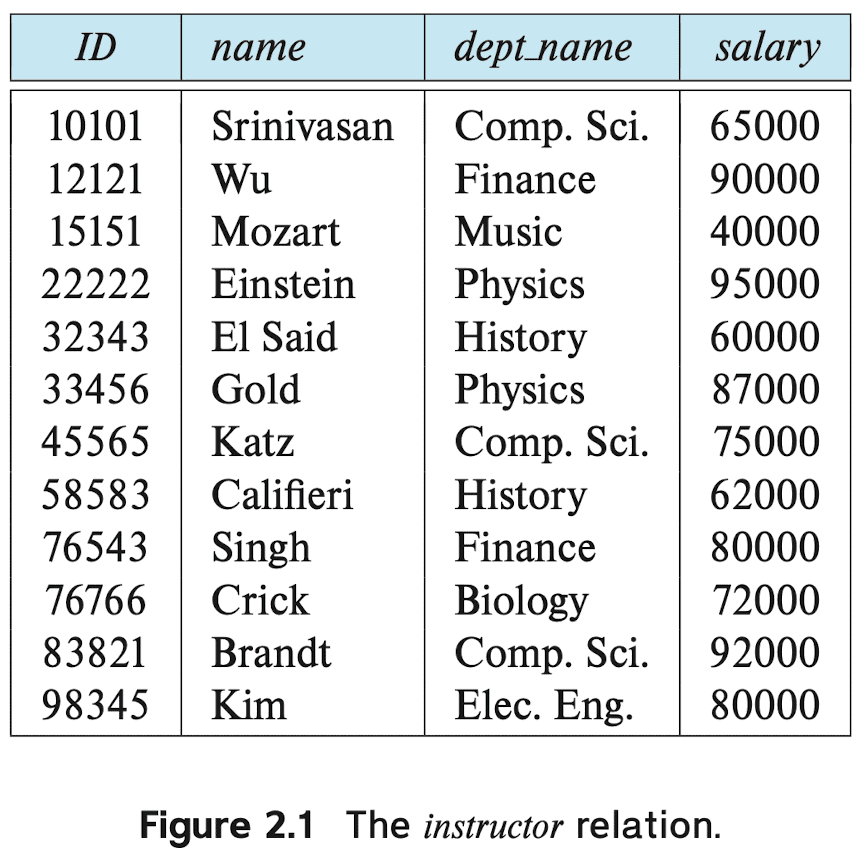
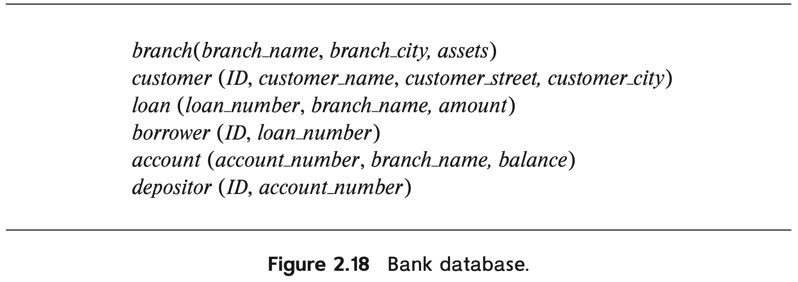
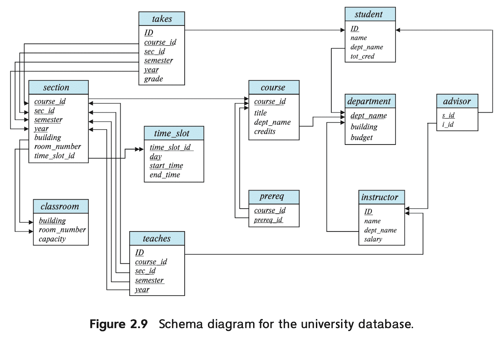
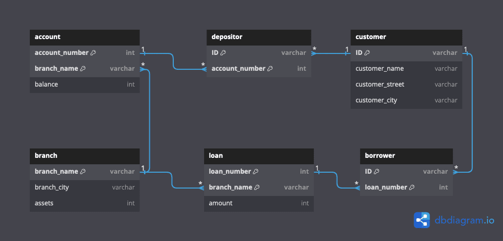

# Table of Contents

click to expand

* [2.1](#21)  
* [2.2](#22)  
* [2.3](#23)  
* [2.4](#24)  
* [2.5](#25)  
* [2.6](#26)  
* [2.7](#27)  
* [2.8](#28)  
* [2.9](#29)  
* [2.10](#210)  
* [2.11](#211)  
* [2.12](#212)  
* [2.13](#213)  
* [2.14](#214)  
* [2.15](#215)  
* [2.16](#216)  
* [2.17](#217)  
* [2.18](#218)  

 

# 2.1

**Question**. Consider the employee database of Figure 2.17. What are the appropriate primary keys?

    

 

<strong>Answer</strong>. click to expand

> person_name, person_name, company_name

 

# 2.2

**Question**. Consider the foreign-key constraint from the <code>dept_name</code> attribute of <code>instructor</code> to the <code>department</code> relation. Give examples of inserts and deletes to these relations that can cause a violation of the foreign-key constraint.

<strong>Answer</strong>. click to expand

> Inserting the <code>instructor</code> tuple $t$ such that $t.{\textrm{dept} \_{-} \textrm{name}} = \textrm{"Medical"}$  
> Deleting the <code>department</code> tuple $(\textrm{Elec. Eng.}, \textrm{Taylor}, 85000)$

 

# 2.3

**Question**. Consider the <em>time_slot</em> relation. Given that a particular <em>time_slot</em> can meet more than once in a week, explain why <em>day</em> and <em>start_time</em> are part of the primary key of this relation, while <em>end_time</em> is not.

<strong>Answer</strong>. click to expand

> The attributes <code>day</code> and <code>start_time</code> are part of the primary key since a particular class will most likely meet on several different days and may even meet more than once in a day. However, <code>end_time</code> is not part of the primary key since a particular class that starts at a particular time on a particular day cannot end at more than one time.

 

# 2.4

**Question**. In the instance of <code>instructor</code> shown in Figure 2.1, no two instructors have the same name. From this, can we conclude that <code>name</code> can be used as a superkey (or primary key) of <code>instructor</code>?

    

 

<strong>Answer</strong>. click to expand

No. Although the <code>name</code> can uniquely identify the tuple of the given instance of the relation, this is not a general case.

 

# 2.5

**Question**. What is the result of first performing the Cartesian product of <code>student</code> and <code>advisor</code>, and then performing a selection operation on the result with the predicate <code>s_id</code> = ID? (Using the symbolic notation of relational algebra, this query can be written as $\sigma_{\textrm{s}\_{-}\textrm{id}=\textrm{ID}}(\textrm{student} \times \textrm{advisor})$.)

<strong>Answer</strong>. click to expand

> All possible pairs generated by combining one <code>student</code> tuple and one <code>advisor</code> tuple will be produced by Cartesian product. By performing the selection operation, only tuples that <code>s_id</code> attribute in the portion of <code>advisor</code> tuple equals to ID attribute in the portion of <code>student</code> tuple. Therefore, a student who has at least one advisor will appear a corresponding number of times in the result.

 

# 2.6

**Question**. Consider the employee database of Figure 2.17. Give an expression in the relational algebra to express each of the following queries:

<ol style="list-style-type: lower-alpha;">
    <li>Find the name of each employee who lives in city "Miami".</li>
    <li>Find the name of each employee whose salary is greater than $100000.</li>
    <li>Find the name of each employee who lives in "Miami" and whose salary is greater than $100000.</li>
</ol>

<strong>Answer</strong>. click to expand

> **a.** $`\Pi_{\textrm{person} \_ \textrm{name}} (\sigma_{\textrm{city} = \textrm{Miami}} (\textrm{employee}))`$  
> **b.** $`\Pi_{\textrm{person} \_ \textrm{name}} (\sigma_{\textrm{salary} > \$ 100000} (\textrm{works}))`$  
> **c.** $`\Pi_{\textrm{person} \_ \textrm{name}} (\textrm{employee} \bowtie_{\textrm{employee}.\textrm{\textrm{person}\_\textrm{name }} = \textrm{ works}.\textrm{\textrm{person}\_\textrm{name }} \wedge \textrm{ city} = \textrm{Miami } \wedge \textrm{ salary} > \$ 100000} \textrm{works})`$  

 

# 2.7

**Question**. Consider the bank database of Figure 2.18. Give an expression in the relational algebra for each of the following queries:

<ol style="list-style-type: lower-alpha;">
    <li>Find the name of each branch located in "Chicago".</li>
    <li>Find the ID of each borrower who has a loan in branch "Downtown".</li>
</ol>

    

 

<strong>Answer</strong>. click to expand

> **a.** $\Pi_{\textrm{branch} \_{-} \textrm{name}} (\sigma_{\textrm{branch} \_{-} \textrm{city} = \textrm{"Chicago"}} (\textrm{branch}))$  
> **b.** $\Pi_{\textrm{ID}} (\sigma_{\textrm{branch} \_{-} \textrm{name} = \textrm{"Downtown"}} (\textrm{borrower} \bowtie_{\textrm{borrower}.\textrm{loan} \_{-} \textrm{number} = \textrm{loan}.\textrm{loan} \_{-} \textrm{number}} \textrm{\textrm{loan}}))$  

 

# 2.8

**Question**. Consider the employee database of Figure 2.17. Give an expression in the relational algebra to express each of the following queries:

<ol style="list-style-type: lower-alpha;">
    <li>Find the ID and name of each employee who does not work for "BigBank"</li>
    <li>Find the ID and name of each employee who earns at least as much as every employee in the database.</li>
</ol>

<strong>Answer</strong>. click to expand

I guess finding ID is an errata;

> **a.** $\Pi_{\textrm{person} \_{-} \textrm{name}} (\textrm{employee}) - \Pi_{\textrm{person} \_{-} \textrm{name}} (\sigma_{\textrm{company} \_{-} \textrm{name} = \textrm{"BigBank"}} (\textrm{works}))$

> **b.** $\Pi_{i.\textrm{person} \_{-} \textrm{name}} (\rho_{i} (\textrm{works}) \bowtie_{i.\textrm{salary} \geq j.\textrm{salary} \wedge i.\textrm{person} \_{-} \textrm{name} \neq j.\textrm{person} \_{-} \textrm{name}} \rho_{j} (\textrm{works})))$  

 

# 2.9

**Question**. The **division operator** of relational algebra, "$`\div`$" is defined as follows. Let $r(R)$ and $s(S)$ be relations, and let $S \subseteq R$; that is, every attribute of schema $S$ is also in schema $R$. Given a tuple $t$, let $t[S]$ denote the projection of tuple $t$ on the attributes in $S$. Then $r \div s$ is a relation on schema $R - S$ (that is, on the schema containing all attributes of schema $R$ that are not in schema $S$).  A tuple $t$ is in $r \div s$ if and only if both of two conditions hold: 

<ul>
    <li>$t$ is in $\Pi_{R-S}(r)$</li>
    <li>For every tuple $t_s$ in $s$, there is a tuple $t_r$ in $r$ satisfying both of the following:
        <ol style="list-style-type: lower-alpha;">
            <li>$t_r[S] = t_s[S]$</li>
            <li>$t_r[R - S] = t$</li>
        </ol>
    </li>
</ul>

<ol style="list-style-type: lower-alpha;">
    <li>Write a relational algebra expression using the division operator to find the IDs of all students who have taken all Comp. Sci. courses. (Hint: project <em>takes</em> to just ID and <em>course_id</em>, and generate the set of all Comp. Sci. <em>course_id</em>s using a select expression, before doing the division.)</li>
    <li>Show how to write the above query in relational algebra, without using division. (By doing so, you would have shown how to define the division operation using the other relational algebra operations.) </li>
</ol>

<strong>Answer</strong>. click to expand

> **a.** $\Pi_{\textrm{id}} (\Pi_{\textrm{id}, \textrm{course} \_{-} \textrm{id}} (\textrm{takes}) \div \Pi_{\textrm{course} \_{-} \textrm{id}} (\sigma_{\textrm{dept} \_{-} \textrm{name} = \textrm{Comp. Sci.}} (\textrm{course})))$  
> **b.** $r \leftarrow \Pi_{\textrm{id},\textrm{course} \_{-} \textrm{id}} (\textrm{takes})$  
> $s \leftarrow \Pi_{\textrm{course} \_{-} \textrm{id}} (\sigma_{\textrm{dept} \_{-} \textrm{name} = \textrm{Comp. Sci.}} (\textrm{course}))$  
> $\Pi_{\textrm{id}} (\textrm{takes}) - \Pi_{\textrm{id}} (\Pi_{\textrm{id}, \textrm{course} \_{-} \textrm{id}} (\Pi_{\textrm{id}} (\textrm{takes}) \times s) - r) $

 

# 2.10

**Question**. Describe the differences in meaning between the terms <em>relation</em> and <em>relation schema</em>.

<strong>Answer</strong>. click to expand

The term <code>relation</code> refers to the table with its elements (called tuples), i.e. a set of tuples and <code>relation schema</code> indicates the list of attributes (columns) that describes relation.

 

# 2.11

**Question**. Consider the <code>advisor</code> relation shown in the schema diagram in Figure 2.9, with <code>s_id</code> as the primary key of <code>advisor</code>. Suppose a student can have more than one <code>advisor</code>. Then, would <code>s_id</code> still be a primary key of the <code>advisor</code> relation? If not, what should the primary key of <code>advisor</code> be?

    

 

<strong>Answer</strong>. click to expand

> No. If two instructors are advising the same student, then two advisors would have the same <code>s_id</code>. Since the ID of an instructor is unique, <code>i_id</code> should be the primary key if an instructor is possible to advise at most one student.

 

# 2.12

**Question**. Consider the bank database of Figure 2.18. Assume that branch names and customer names uniquely identify branches and customers, but loans and accounts can be associated with more than one customer.

<ol style="list-style-type: lower-alpha;">
    <li>What are the appropriate primary keys?</li>
    <li>Given your choice of primary keys, identify appropriate foreign keys.</li>
</ol>

<strong>Answer</strong>. click to expand

> **a.** <u>branch_name</u> 
<u>ID</u> 
<u>loan_number</u>, <u>branch_name</u> 
<u>ID</u>, <u>loan_number</u> 
<u>account_number</u>, <u>branch_name</u> 
<u>ID</u>, <u>account_number</u> 

> **b.** <code>ID</code> is the foreign key from <code>borrower</code> and <code>depositor</code>, referencing <code>customer</code>.  
<code>account_number</code> is the foreign key from <code>depositor</code>, referencing <code>account</code>.  
<code>branch_name</code> is the foreign key from <code>account</code>, referencing <code>branch</code>.  
<code>loan_number</code> is the foreign key from <code>borrower</code>, referencing <code>loan</code>.  

 

# 2.13

**Question**. Construct a schema diagram for the bank database of Figure 2.18. 

<strong>Answer</strong>. click to expand

Primary keys are highlighted.

    

 

 

# 2.14

**Question**. Consider the employee database of Figure 2.17. Give an expression in the relational algebra to express each of the following queries:

<ol style="list-style-type: lower-alpha;">
    <li>Find the ID and name of each employee who works for "BigBank".</li>
    <li>Find the ID, name, and city of residence of each employee who works for "BigBank".</li>
    <li>Find the ID, name, street address, and city of residence of each employee who works for "BigBank" and earns more than $10000.</li>
    <li>Find the ID and name of each employee in this database who lives in the same city as the company for which she or he works.</li>
</ol>

<strong>Answer</strong>. click to expand

I guess finding ID is an errata;

> **a.** $`\Pi_{\textrm{employee}.\textrm{person}\_\textrm{name}} (\sigma_{\textrm{company}\_\textrm{name} = \textrm{BigBank}} (\textrm{employee} \bowtie_{\textrm{employee}.\textrm{person}\_\textrm{name} = \textrm{works}.\textrm{person}\_\textrm{name}} \textrm{works}))`$  
> **b.** $`\Pi_{\textrm{employee}.\textrm{person}\_\textrm{name}, \textrm{city}} (\sigma_{\textrm{company}\_\textrm{name} = \textrm{BigBank}} (\textrm{employee} \bowtie_{\textrm{employee}.\textrm{person}\_\textrm{name} = \textrm{works}.\textrm{person}\_\textrm{name}} \textrm{works}))`$  
> **c.** $`\Pi_{\textrm{employee}.\textrm{person}\_\textrm{name}, \textrm{street}, \textrm{city}} (\sigma_{\textrm{company}\_\textrm{name} = \textrm{BigBank} \wedge \textrm{salary} > \$10000} (\textrm{employee} \bowtie_{\textrm{employee}.\textrm{person}\_\textrm{name} = \textrm{works}.\textrm{person}\_\textrm{name}} \textrm{works}))`$   
> **d.** $`\Pi_{\textrm{employee}.\textrm{person}\_\textrm{name}} (\sigma_{\textrm{employee}.\textrm{city} = \textrm{company}.\textrm{city}} (\textrm{employee} \bowtie_{\textrm{employee}.\textrm{person}\_\textrm{name} = \textrm{works}.\textrm{person}\_\textrm{name}} \textrm{works} \bowtie_{\textrm{works}.\textrm{company}\_\textrm{name} = \textrm{company}.\textrm{company}\_\textrm{name}} \textrm{company} ))`$  

 

# 2.15

**Question**. Consider the bank database of Figure 2.18. Give an expression in the relational algebra for each of the following queries:

<ol style="list-style-type: lower-alpha;">
    <li>Find each loan number with a loan amount greater than $10000.</li>
    <li>Find the ID of each depositor who has an account with a balance greater than $6000.</li>
    <li>Find the ID of each depositor who has an account with a balance greater than $6000 at the "Uptown" branch.</li>
</ol>

<strong>Answer</strong>. click to expand

> **a.** $`\Pi_{\textrm{loan}\_\textrm{number}} (\sigma_{\textrm{amount} > \$10000} (\textrm{loan}))`$  
> **b.** $`\Pi_{\textrm{ID}} (\sigma_{\textrm{balance} >\$6000} ( \textrm{depositor} \bowtie_{\textrm{depositor}.\textrm{account}\_\textrm{name} = \textrm{account}.\textrm{account}\_\textrm{name}} \textrm{account}))`$  
> **c.** $`\Pi_{\textrm{ID}} (\sigma_{\textrm{balance} > \$6000 \wedge \textrm{branch}\_\textrm{name} = \textrm{Uptown}} ( \textrm{depositor} \bowtie_{\textrm{depositor}.\textrm{account}\_\textrm{name} = \textrm{account}.\textrm{account}\_\textrm{name}} \textrm{account}))`$  

 

# 2.16

**Question**. List two reasons why null values might be introduced into a database. 

<strong>Answer</strong>. click to expand

> Null values in a database can arise due to various reasons, but here are two common ones:  
**Missing Information**: Null values may be introduced when data is incomplete or missing. For example, if a user does not provide a value for a certain field when filling out a form or if a sensor fails to capture data, the corresponding database entry may contain a null value for that field.  
**Optional Fields**: Null values can also be intentionally introduced to represent optional fields that are not applicable or not provided. In database design, certain fields may be designated as nullable, meaning they can accept null values. This allows flexibility in data entry and accommodates situations where certain information may not be available or relevant for every record.

 

# 2.17

**Question**. Discuss the relative merits of imperative, functional, and declarative languages. 

<strong>Answer</strong>. click to expand

Merits of imperative languages

    Easy to read
    Conceptual model (solution path) is very easy for beginners to understand.
    Characteristics of specific applications can be taken into account. for more

Mertis of functional languages

    Lazy Evaluation
    Seamless Parallel Programming for more

Merits of declarative languages

    easy to use (since you only tell what you need).

 

# 2.18

**Question**. Write the following queries in relational algebra, using the university schema.

<ol style="list-style-type: lower-alpha;">
    <li>Find the ID and name of each instructor in the Physics department.</li>
    <li>Find the ID and name of each instructor in a department located in the building "Watson".</li>
    <li>Find the ID and name of each student who has taken at least one course in the "Comp. Sci." department.</li>
    <li>Find the ID and name of each student who has taken at least one course section in the year 2018.</li>
    <li>Find the ID and name of each student who has not taken any course section in the year 2018.</li>
</ol>

<strong>Answer</strong>. click to expand

> **a.** $\Pi_{\textrm{ID}, \textrm{name}} (\sigma_{\textrm{dept}\_{-}\textrm{name} = \textrm{Physics}} (\textrm{instructor}))$  
> **b.** $\Pi_{\textrm{ID}, \textrm{name}} (\sigma_{\textrm{building} = \textrm{Watson}} (\textrm{instructor} \bowtie_{\textrm{instructor}.\textrm{dept}\_{-}\textrm{name} = \textrm{department}.\textrm{dept}\_{-}\textrm{name}} \textrm{department} ))$  
> **c.** $\Pi_{\textrm{ID}, \textrm{name}} (\sigma_{\textrm{dept}\_{-}\textrm{name} = \textrm{Comp. Sci.}} (\rho_{S} (\textrm{student} \bowtie_{\textrm{student}.\textrm{ID} = \textrm{takes}.\textrm{ID}} \textrm{takes} ) \bowtie_{S.\textrm{course}\_{-}\textrm{id} = \textrm{course}.\textrm{course}\_{-}\textrm{id}} \textrm{course}))$  
> **d.** $\Pi_{\textrm{student}.\textrm{ID}, \textrm{name}} (\sigma_{\textrm{year} = 2018} (\textrm{student} \bowtie_{\textrm{student}.\textrm{ID} = \textrm{takes}.\textrm{ID}} \textrm{takes}))$  
> **e.** $\Pi_{\textrm{ID}, \textrm{name}} (\textrm{student}) - \Pi_{\textrm{student}.\textrm{ID}, \textrm{name}} (\sigma_{\textrm{year} = 2018} \textrm{student} (\bowtie_{\textrm{student}.\textrm{ID} = \textrm{takes}.\textrm{ID}} \textrm{takes}))$  

 
