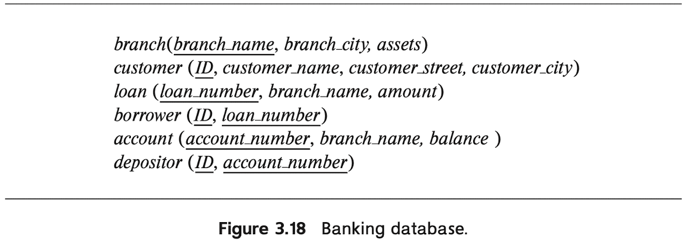

# Table of Contents
<details><summary>click to expand</summary>

* [3.1](#31) <br>
* [3.2](#32) <br>
* [3.3](#33) <br>
* [3.4](#34) <br>
* [3.5](#35) <br>
* [3.6](#36) <br>
* [3.7](#37) <br>
* [3.8](#38) <br>
* [3.9](#39) <br>
* [3.10](#310) <br>
* [3.11](#311) <br>
* [3.12](#312) <br>
* [3.13](#313) <br>
* [3.14](#314) <br>
* [3.15](#315) <br>
* [3.16](#316) <br>
* [3.17](#317) <br>
* [3.18](#318) <br>
* [3.19](#319) <br>
* [3.20](#320) <br>
* [3.21](#321) <br>
* [3.22](#322) <br>
* [3.23](#323) <br>
* [3.24](#324) <br>
* [3.25](#325) <br>
* [3.26](#326) <br>
* [3.27](#327) <br>
* [3.28](#328) <br>
* [3.29](#329) <br>
* [3.30](#330) <br>
* [3.31](#331) <br>
* [3.32](#332) <br>
* [3.33](#333) <br>
* [3.34](#334) <br>
* [3.35](#335) <br>

</details><br>

# 3.1

**Question**. Write the following queries in SQL, using the university schema. (We suggest you actually run these queries on a database, using the sample data that we provide on the web site of the book, [db-book.com]("db-book.com"). Instructions for setting up a database, and loading sample data, are provided on the above web site.)

<ol style="list-style-type: lower-alpha;">
    <li>Find the titles of courses in the Comp. Sci. department that have 3 credits.</li>
    <li>Find the IDs of all students who were taught by an instructor named Einstein; make sure there are no duplicates in the result.</li>
    <li>Find the highest salary of any instructor.</li>
    <li>Find all instructors earning the highest salary (there may be more than one with the same salary).</li>
    <li>Find the enrollment of each section that was offered in Fall 2017.</li> 
    <li>Find the maximum enrollment, across all sections, in Fall 2017.</li>
    <li>Find the sections that had the maximum enrollment in Fall 2017.</li>
</ol>

<details><summary><strong>Answer</strong>. click to expand</summary>

> **a.** 

```sql
SELECT title
FROM course
WHERE dept_name = 'Comp. Sci.' AND credits = 3
```

Result:

|         **title**         |
|:-------------------------:|
| Robotics                  |
| Image Processing          |
| Database System Concepts  |

> **b.**

```sql
SELECT DISTINCT takes.ID
FROM takes, teaches, instructor 
WHERE teaches.ID = instructor.ID AND
      takes.course_id = teaches.course_id AND 
      takes.sec_id = teaches.sec_id AND 
      takes.semester = teaches.semester AND
      takes.year = teaches.year AND
      instructor.name = 'Einstein'
```

Result:

|         **s_ID**          |
|:-------------------------:|
| 44553                     |

> **c.**

```sql
SELECT MAX (salary) AS highest_salary
FROM instructor 
```

Result:

|  **highest_salary**  |
|:--------------------:|
| 95000                |

> **d.**

```sql
WITH highest_salary (salary) AS ( SELECT MAX (salary)
                                  FROM instructor )
SELECT instructor.*
FROM instructor, highest_salary
WHERE instructor.salary = highest_salary.salary
```

Result:

| **ID** | **name** | **dept_name** | **salary** |
|:------:|:--------:|:-------------:|:----------:|
| 22222  | Einstein | Physics       | 95000      |

> **e.**

```sql
SELECT section.course_id, section.sec_id, COUNT (DISTINCT ID) AS enrollment
FROM section, takes
WHERE section.course_id = takes.course_id AND
      section.sec_id = takes.sec_id AND
      section.semester = takes.semester AND
      section.year = takes.year AND
      section.semester = 'Fall' AND section.year = 2017
GROUP BY section.course_id, section.sec_id
```

Result:

| **course_id** | **sec_id** | **enrollment** | 
|:-------------:|:----------:|:--------------:|
|  CS-101	    |  1	     |   6            |
|  CS-347	    |  1	     |   2            |
|  PHY-101	    |  1	     |   1            |

> **f.**

```sql
WITH list (course_id, sec_id, enrollment) AS ( SELECT section.course_id, section.sec_id, COUNT (DISTINCT ID) AS enrollment
                                               FROM section, takes
                                               WHERE section.course_id = takes.course_id AND
                                                     section.sec_id = takes.sec_id AND
                                                     section.semester = takes.semester AND
                                                     section.year = takes.year AND
                                                     section.semester = 'Fall' AND section.year = 2017
                                               GROUP BY section.course_id, section.sec_id )
SELECT MAX (enrollment) AS max_enrollment
FROM list
```

Result:

| **max_enrollment** | 
|:------------------:|
|   6                |

> **g.**

```sql
WITH list (course_id, sec_id, enrollment) AS ( SELECT section.course_id, section.sec_id, COUNT (DISTINCT ID) AS enrollment
                                               FROM section, takes
                                               WHERE section.course_id = takes.course_id AND
                                                     section.sec_id = takes.sec_id AND
                                                     section.semester = takes.semester AND
                                                     section.year = takes.year AND
                                                     section.semester = 'Fall' AND section.year = 2017
                                               GROUP BY section.course_id, section.sec_id ),
     max_enrollment (enrollment) 		  AS ( SELECT MAX (enrollment) 
                        					   FROM list )
SELECT list.*
FROM list, max_enrollment
WHERE list.enrollment = max_enrollment.enrollment
```

Result:

| **course_id** | **sec_id** | **enrollment** | 
|:-------------:|:----------:|:--------------:|
|  CS-101	    |  1	     |   6            |


</details><br>

# 3.2

**Question**. Suppose you are given a relation <code>grade_points(<u>grade</u>, points)</code> that provides a conversion from letter grades in the takes relation to numeric scores; for example, an "A" grade could be specified to correspond to 4 points, an "A-" to 3.7 points, a "B+" to 3.3 points, a "B" to 3 points and so on. The grade points earned by a student for a course offering (section) is defined as the number of credits for the course multiplied by the numeric points for the grade that the student received.

Given the preceding relation and our university schema, write each of the following queries in SQL. You may assume for simplicity that no takes tuple has the null value for grade.

<ol style="list-style-type: lower-alpha;">
    <li>Find the total grade points earned by the student with ID '12345', across all courses taken by the student.</li>
    <li>Find the grade point average (GPA) for the above student, that is, the total grade points divided by the total credits for the associated courses.</li>
    <li>Find the ID and the grade-point average of each student.</li>
    <li>Now reconsider your answers to the earlier parts of this exercise under the assumption that some grades might be null. Explain whether your solutions still work and, if not, provide versions that handle nulls properly.</li>
</ol>

<details><summary><strong>Answer</strong>. click to expand</summary>

> **a.** 

```sql
SELECT SUM (credits * points)
FROM takes, course, grade_points
WHERE takes.ID = '12345' AND 
      takes.grade = grade_ponts.grade AND
      takes.course_id = course.course_id
```

> **b.** 

```sql
SELECT SUM (credits * points) / tot_cred
FROM takes, course, grade_points, student
WHERE takes.ID = '12345' AND 
      takes.grade = grade_ponts.grade AND
      takes.course_id = course.course_id AND 
      takes.ID = student.ID
```

> **c.** 

```sql
SELECT ID, SUM (credits * points) / tot_cred
FROM takes, course, grade_points, student
WHERE takes.grade = grade_ponts.grade AND
      takes.course_id = course.course_id AND 
      takes.ID = student.ID
GROUP BY student.ID
```

> **d.**  Yes, because arithmetic operations including <code>NULL</code> is still <code>NULL</code>, and all aggregate functions except <code>COUNT</code> ignore <code>NULL</code> values in their input collection. 

</details><br>

# 3.3

**Question**. Write the following inserts, deletes, or updates in SQL, using the university schema.

<ol style="list-style-type: lower-alpha;">
    <li>Increase the salary of each instructor in the Comp. Sci. department by 10%.</li>
    <li>Delete all courses that have never been offered (i.e., do not occur in the <em>section</em> relation).</li>
    <li>Insert every student whose <em>tot_cred</em> attribute is greater than 100 as an instructor in the same department, with a salary of $10,000.</li>
</ol>

<details><summary><strong>Answer</strong>. click to expand</summary>

> **a.**

```sql
UPDATE instructor
SET salary = salary * 1.1
WHERE dept_name = 'Comp. Sci.'
```

> **b.**

```sql
DELETE FROM course
WHERE course_id NOT IN (SELECT course_id FROM section)
```

> **c.**

```sql
INSERT INTO instructor
    (SELECT ID, name, dept_name, 10000
    FROM student
    WHERE tot_cred > 100);
```

> **d.**

```sql
INSERT INTO instructor
VALUE (SELECT ID, name, dept_name, 10000
       FROM student
       WHERE tot_cred > 100)
```

</details><br>

# 3.4

**Question**. Consider the insurance database of Figure 3.17, where the primary keys are underlined. Construct the following SQL queries for this relational database.

<ol style="list-style-type: lower-alpha;">
    <li>Find the total number of people who owned cars that were involved in accidents in 2017.</li>
    <li>Delete all year-2010 cars belonging to the person whose ID is '12345'</li>
</ol>

<p align = "center">
    
</p><br>

<details><summary><strong>Answer</strong>. click to expand</summary>

> **a.** 

```sql
SELECT COUNT (DISTINCT owns.driver_id)
FROM owns, participated, accident
WHERE participated.license_plate = owns.license_plate AND
      accident.report_number = participated.report_number AND
      year = '2017'
```

> **b.** 

```sql
DELETE FROM car
WHERE (
    SELECT car.*
    FROM car, owns
    WHERE car.license_plate = owns.license_plate AND
          car.year = 2010 AND
          owns.driver_id = '12345'
);
```

</details><br>

# 3.5

**Question**. Suppose that we have a relation <code>marks(ID, score)</code> and we wish to assign grades to students based on the score as follows: grade F if <code>score < 40</code>, grade C if <code>40 ≤ score < 60</code>, grade B if <code>60 ≤ score < 80</code>, and grade A if <code>80 ≤ score</code>. Write SQL queries to do the following:

<ol style="list-style-type: lower-alpha;">
    <li>Display the grade for each student, based on the marks relation.</li>
    <li>Find the number of students with each grade.</li>
</ol>

<details><summary><strong>Answer</strong>. click to expand</summary>

> **a.**

```sql
SELECT ID, (
    CASE
        WHEN score < 40 THEN 'F'
        WHEN score < 60 THEN 'C'
        WHEN score < 80 THEN 'B'
        ELSE 'A'
    END);
FROM marks
```

> **b.**

```sql
SELECT grade, COUNT (DISTINCT ID) AS num 
FROM (SELECT ID, ( 
        CASE
            WHEN score >= 80 THEN 'A'
            WHEN 80 > score >= 60 THEN 'B'
            WHEN 60 > score >= 40 THEN 'C'
            ELSE 'F'
        END) AS grade
    FROM marks)
GROUP BY grade
```

</details><br>

# 3.6

**Question**. The SQL **like** operator is case sensitive (in most systems), but the <code>lower()</code> function on strings can be used to perform case-insensitive matching. To show how, write a query that finds departments whose names contain the string "sci" as a substring, regardless of the case.

<details><summary><strong>Answer</strong>. click to expand</summary>

```sql
SELECT dept_name  
FROM department
WHERE LOWER (dept_name) LIKE '%sci%'
```

</details><br>

# 3.7

**Question**. Consider the SQL query

```SQL
SELECT p.a1
FROM p, r1, r2
WHERE p.a1 = r1.a1 or p.a1 = r2.a1
```

Under what conditions does the preceding query select values of <code>p.a1</code> that are either in <code>r1</code> or in <code>r2</code>? Examine carefully the cases where either <code>r1</code> or <code>r2</code> maybe empty.

<details><summary><strong>Answer</strong>. click to expand</summary>

The query selects those values of <code>p.a1</code> that are equal to either value of <code>r1.a1</code> or <code>r2.a1</code> if and only if both <code>r1</code> and <code>r2</code> are non-empty. If one or both of <code>r1</code> and <code>r2</code> are empty, the Cartesian product of <code>p</code>, <code>r1</code> and <code>r2</code> is empty, hence the result of the query is empty. If <code>p</code> itself is empty, the result is empty.

Mathmatically, $A \times B = \emptyset$ iff $A = \emptyset$ or $B = \emptyset$. If $A = \emptyset$ or $B = \emptyset$, then there is no $(a,b)$ such that $a \in A$ and $b \in B$, i.e. $(a, b) \in A \times B$. Therefore $A \times B$ is empty. Conversely, if both $A \neq \emptyset$ and $B \neq \emptyset$, there exists there exists $a \in A$ and $b \in B$, thus $(a, b) \in A \times B$. Therefore $A \times B \neq \emptyset$.

</details><br>

# 3.8

**Question**. Consider the bank database of Figure 3.18, where the primary keys are underlined. Construct the following SQL queries for this relational database.

<ol style="list-style-type: lower-alpha;">
    <li>Find the ID of each customer of the bank who has an account but not a loan.</li>
    <li>Find the ID of each customer who lives on the same street and in the same city as customer '12345'.</li>
    <li>Find the name of each branch that has at least one customer who has an account in the bank and who lives in "Harrison".</li>
</ol>

<p align = "center">
    
</p><br>

<details><summary><strong>Answer</strong>. click to expand</summary>

> **a.**

```sql
SELECT DISTINCT customer.ID
FROM customer, depositor, borrower
WHERE customer.ID = depositor.ID AND
      customer.ID NOT IN ( SELECT ID
                           FROM borrower )
```

Equivalently, 

```sql
SELECT ID
FROM depositor
EXCEPT 
SELECT ID 
FROM borrower
```

> **b.**

```sql
WITH customer_12345 (street, city) AS (SELECT customer_street, customer_city FROM customer WHERE ID = '12345')
SELECT ID 
FROM customer, customer_12345
WHERE customer_street = street AND customer_city = city
```

> **c.**

```sql
SELECT branch_name
FROM account 
WHERE account_number IN ( SELECT account_number 
                          FROM depositor, customer
                          WHERE depositor.ID = customer.ID AND 
                                customer_city = 'Harrison')
```

</details><br>

# 3.9

**Question**. Consider the relational database of Figure 3.19, where the primary keys are underlined. Give an expression in SQL for each of the following queries.

<ol style="list-style-type: lower-alpha;">
    <li>Find the ID, name, and city of residence of each employee who works for "First Bank Corporation".</li>
    <li>Find the ID, name, and city of residence of each employee who works for "First Bank Corporation" and earns more than $10000.</li>
    <li>Find the ID of each employee who does not work for "First Bank Corporation".</li>
    <li>Find the ID of each employee who earns more than every employee of "Small Bank Corporation".</li>
    <li>Assume that companies may be located in several cities. Find the name of each company that is located in every city in which "Small Bank Corporation" is located.</li>
    <li>Find the name of the company that has the most employees (or companies, in the case where there is a tie for the most).</li>
    <li>Find the name of each company whose employees earn a higher salary, on average, than the average salary at "First Bank Corporation".</li>
</ol>

<p align = "center">
    
</p><br>

<details><summary><strong>Answer</strong>. click to expand</summary>

> **a.** 

```sql
SELECT ID, person_name, city
FROM employee, works
WHERE employee.ID = works.ID AND company_name = 'First Bank Corporation'
```

> **b.** 

```sql
SELECT ID, person_name, city
FROM employee, works
WHERE employee.ID = works.ID AND 
      company_name = 'First Bank Corporation' AND
      salary > 10000
```

> **c.** 

```sql
SELECT ID
FROM works
WHERE company_name <> 'First Bank Corporation'
```

> **d.** 

```sql
SELECT ID
FROM employee, works
WHERE employee.ID = works.ID AND
      salary > (SELECT MAX(salary) FROM works WHERE company_name = 'Small Bank Corporation')
```

> **e.** 

```sql
SELECT DISTINCT company_name
FROM company
WHERE city IN (SELECT city FROM company WHERE company_name = 'Small Bank Corporation')
```

> **f.** 

```sql
WITH worker_numbers (company_name, num_workers) AS (
    SELECT company_name, COUNT (DISTINCT works.ID) AS num_workers
    FROM company, works
    WHERE company.company_name = works.company_name
    GROUP BY company_name);
SELECT company_name
FROM worker_numbers 
WHERE worker_numbers.num_workers = (SELECT MAX(num_workers) FROM worker_numbers);
```

> **g.** 

```sql
WITH avg_salaries (company_name, avg_salary) AS (
    SELECT company_name, AVG (salary) AS avg_salary
    FROM works
    GROUP BY company_name);
SELECT company_name
FROM avg_salaries
WHERE avg_salaries.avg_salary > (SELECT avg_salary FROM avg_salaries WHERE company_name = 'First Bank Corporation');
```

</details><br>

# 3.10

**Question**. Consider the relational database of Figure 3.19. Give an expression in SQL for each of the following:

<ol style="list-style-type: lower-alpha;">
    <li>Modify the database so that the employee whose ID is '12345' now lives in "Newtown".</li>
    <li>Give each manager of "First Bank Corporation" a 10 percent raise unless the salary becomes greater than $100000; in such cases, give only a 3 percent raise.</li>
</ol>

<details><summary><strong>Answer</strong>. click to expand</summary>

> **a.** 

```sql
UPDATE employee
SET city = 'Newtown'
WHERE ID = '12345'
```

> **b.**

```sql
UPDATE employee
SET salary = salary * (
    CASE 
        WHEN 100000 < salary * 1.10 THEN 1.03
        ELSE 1.10
    END
)
WHERE ID IN (
    SELECT employee.ID
    FROM works
    WHERE company_name = 'First Bank Corporation' AND 
          works.ID IN (
            --- Set of manager_id ---
            SELECT DISTINCT manager_id
            FROM manages
          )
    );
```

</details><br>

# 3.11

**Question**. Write the following queries in SQL, using the university schema.


<ol style="list-style-type: lower-alpha;">
    <li>Find the ID and name of each student who has taken at least one Comp. Sci. course; make sure there are no duplicate names in the result.</li>
    <li>Find the ID and name of each student who has not taken any course offered before 2017.</li>
    <li>For each department, find the maximum salary of instructors in that department. You may assume that every department has at least one instructor.</li>
    <li>Find the lowest, across all departments, of the per-department maximum salary computed by the preceding query.</li>
</ol>

<details><summary><strong>Answer</strong>. click to expand</summary>

> **a.**

```sql
SELECT DISTINCT student.ID, name
FROM student, takes, course
WHERE student.ID = takes.ID AND
      takes.course_ID = course.course_ID AND
      course.dept_name = 'Comp. Sci.'
```

Result:


| **ID** | **name** |
|:------:|:--------:|
| 00128  | Zhang    |
| 12345  | Shankar  |
| 45678  | Levy     |
| 54321  | Williams |
| 76543  | Brown    |
| 98765  | Bourikas |

> **b.**

```sql
SELECT DISTINCT ID, name
FROM student AS S
WHERE NOT EXISTS ( SELECT * 
                   FROM takes 
                   WHERE takes.ID = S.ID AND takes.year < 2017)
```

Result:


| **ID** | **name** |
|:------:|:--------:|
| 00128  | Zhang    |
| 12345  | Shankar  |
| 19991  | Brandt   |
| 23121  | Chavez   |
| 44553  | Peltier  |
| 45678  | Levy     |
| 54321  | Williams |
| 55739  | Sanchez  |
| 70557  | Snow     |
| 76543  | Brown    |
| 76653  | Aoi      |
| 98765  | Bourikas |
| 98988  | Tanaka   |


> **c.**

```sql
SELECT dept_name, MAX (salary) as max_salary
FROM instructor 
GROUP BY dept_name
```

Result:

| **dept_name** | **max_salary** |
|:-------------:|:--------------:|
| Biology       | 72000          |
| Comp. Sci.    | 92000          |
| Elec. Eng.    | 80000          |
| Finance       | 90000          |
| History       | 62000          |
| Music         | 40000          |
| Physics       | 95000          |

> **d.**

```sql
WITH max_salaries (dept_name, max_salary) AS ( SELECT dept_name, MAX (salary) as max_salary
                                               FROM instructor 
                                               GROUP BY dept_name )
SELECT dept_name, MIN (max_salary) AS max_salary
FROM max_salaries
```

Result:

| **dept_name** | **max_salary** |
|:-------------:|:--------------:|
| Music         | 40000          |


</details><br>

# 3.12

**Question**. Write the SQL statements using the university schema to perform the following operations:

<ol style="list-style-type: lower-alpha;">
    <li>Create a new course "CS-001", titled "Weekly Seminar", with 0 credits.</li>
    <li>Create a section of this course in Fall 2017, with <code>sec_id</code> of 1, and with the location of this section not yet specified.</li>
    <li>Enroll every student in the Comp. Sci. department in the above section.</li>
    <li>Delete enrollments in the above section where the student's ID is 12345.</li>
    <li>Delete the course CS-001. What will happen if you run this delete statement without first deleting offerings (sections) of this course?</li>
    <li>Delete all takes tuples corresponding to any section of any course with the word "advanced" as a part of the title; ignore case when matching the word with the title.</li>
</ol>

<details><summary><strong>Answer</strong>. click to expand</summary>

> **a.** 

```sql
INSERT INTO course
VALUES ('CS-001', 'Weekly Seminar', 'Comp. Sci', 0)
```

> **b.** 

```sql
INSERT INTO section
VALUES ('CS-001', 1, 'Fall', 2017, NULL, NULL, NULL)
```

> **c.** 

```sql
INSERT INTO takes
SELECT ID, 'CS-001', 1, 'Fall', 2017, NULL
FROM student
WHERE dept_name = 'Comp. Sci'
```

> **d.** 

```sql
DELETE FROM takes
WHERE ID = '12345' AND (course_id, sec_id, semester, year) = ('CS-001', '1', 'Fall', 2017)
```

> **e.** 

```sql
DELETE FROM course
WHERE course_id = 'CS-001'
```

Then the primary key constraint is not satisfied. 

> **f.**

```sql
DELETE FROM takes
WHERE course_id IN (
    SELECT course_id
    FROM course
    WHERE LOWER(title) LIKE '%advanced%'
)
```

</details><br>

# 3.13

**Question**. Write SQL DDL corresponding to the schema in Figure 3.17. Make any reasonable assumptions about data types, and be sure to declare primary and foreign keys.

<details><summary><strong>Answer</strong>. click to expand</summary>

```sql
CREATE TABLE person (
    driver_id   INT,
    name        VARCHAR(20),
    address     VARCHAR(20),

    PRIMARY KEY (driver_id)
);

CREATE TABLE car (
    license_plate   INT,
    model           VARCHAR(20),
    year            INT,

    PRIMARY KEY (license_plate)
);

CREATE TABLE accident (
    report_number   INT,
    year            INT,
    location        VARCHAR(20),

    PRIMARY KEY (report_number)
);

CREATE TABLE owns (
    driver_id       INT,
    license_plate   INT,
    
    PRIMARY KEY (driver_id),
    PRIMARY KEY (license_plate),
    FOREIGN KEY (driver_id) REFERENCES person,
    FOREIGN KEY (license_plate) REFERENCES car
);

CREATE TABLE participated (
    report_number   INT,
    license_plate   INT,
    address         VARCHAR(20),
    driver_id       INT,
    damage_amount   INT,

    PRIMARY KEY (report_number),
    PRIMARY KEY (license_plate),
    FOREIGN KEY (report_number) REFERENCES accident,
    FOREIGN KEY (license_plate) REFERENCES car,
    FOREIGN KEY (driver_id) REFERENCES person 
);
```

</details><br>

# 3.14

**Question**. Consider the insurance database of Figure 3.17, where the primary keys are underlined. Construct the following SQL queries for this relational database.

<ol style="list-style-type: lower-alpha;">
    <li>Find the number of accidents involving a car belonging to a person named "John Smith".</li>
    <li>Update the damage amount for the car with license plate "AABB2000" in the accident with report number "AR2197" to $3000.</li>
</ol>

<details><summary><strong>Answer</strong>. click to expand</summary>

> **a.** 

```sql
SELECT COUNT (DISTINCT report_number)
FROM person, car, participated
WHERE person.driver_id = owns.driver_id
      owns.license_plate = participated.license_plate
      person.name = 'John Smith'
```

> **b.** 

```sql
UPDATE participated
SET damage_amount = 3000
WHERE license_plate = 'AABB2000' AND report_number = 'AR2197';
```

</details><br>

# 3.15

**Question**. Consider the bank database of Figure 3.18, where the primary keys are under-lined. Construct the following SQL queries for this relational database.

<ol style="list-style-type: lower-alpha;">
    <li>Find each customer who has an account at every branch located in "Brooklyn".</li>
    <li>Find the total sum of all loan amounts in the bank.</li>
    <li>Find the names of all branches that have assets greater than those of at least one branch located in "Brooklyn".</li>
</ol>

<details><summary><strong>Answer</strong>. click to expand</summary>

> **a.** 

```sql
SELECT DISTINCT customer.ID, customer_name
FROM customer, depositor, account
WHERE customer.ID = depositor.ID AND
      depositor.account_number = account.account_number AND 
      account.branch_name IN (SELECT branch_name FROM branch WHERE branch_city = 'Brookyln');
```

> **b.** 

The total sum of all loan amounts in all banks:

```sql
SELECT SUM (amount)
FROM loan
```

The total sum of all loan amounts for each bank:

```sql
SELECT branch.branch_name, SUM (loan.amount)
FROM loan, branch
WHERE loan.branch_name = branch.branch_name AND 
GROUP BY branch.branch_name
```

> **c.** 

```sql
SELECT branch_name
FROM branch
WHERE assets > SOME (SELECT assets FROM branch WHERE branch_city = 'Brookyln');
```

</details><br>

# 3.16

**Question**. Consider the employee database of Figure 3.19, where the primary keys are underlined. Give an expression in SQL for each of the following queries.

<ol style="list-style-type: lower-alpha;">
    <li>Find ID and name of each employee who lives in the same city as the location of the company for which the employee works.</li>
    <li>Find ID and name of each employee who lives in the same city and on the same street as does her or his manager.</li>
    <li>Find ID and name of each employee who earns more than the average salary of all employees of her or his company.</li>
    <li>Find the company that has the smallest payroll.</li>
</ol>

<details><summary><strong>Answer</strong>. click to expand</summary>

> **a.**

```sql
SELECT employee.ID, person_name
FROM employee, works
WHERE employee.ID = works.ID AND
      city IN (SELECT city FROM company WHERE city = employee.city) 
```

> **b.**

```sql
SELECT employee.ID, person_name
FROM employee, manages
WHERE employee.ID = manages.ID AND
      (employee.street, employee.city) IN (SELECT street, city FROM employee WHERE employee.ID = manages.manager_id) 
```

> **c.**

```sql
WITH avg_salaries (company_name, avg_salary) AS (
    SELECT company_name, AVG (salary) AS avg_salary
    FROM works
    GROUP BY company_name
)
SELECT E.ID, person_name
FROM employee AS E, works AS W
WHERE E.ID = W.ID AND
      salary > (SELECT avg_salary FROM avg_salaries WHERE company_name = W.company_name)
```

> **d.**

```sql
SELECT company_name
FROM works
GROUP BY company_name
HAVING SUM (salary) < ALL (SELECT SUM (salary) FROM works GROUP BY company_name);
```

</details><br>

# 3.17

**Question**. Consider the employee database of Figure 3.19. Give an expression in SQL for each of the following queries.

<ol style="list-style-type: lower-alpha;">
    <li>Give all employees of "First Bank Corporation" a 10 percent raise.</li>
    <li>Give all managers of "First Bank Corporation" a 10 percent raise.</li>
    <li>Delete all tuples in the works relation for employees of "Small Bank Cor-poration".</li>
</ol>

<details><summary><strong>Answer</strong>. click to expand</summary>

> **a.**

```sql
UPDATE works
SET salary = 1.1 * salary
WHERE company_name = 'First Bank Corporation'
```

> **b.**

```sql
UPDATE works
SET salary = 1.1 * salary
WHERE company_name = 'First Bank Corporation' AND ID IN (SELECT manager_id FROM manages)
```

> **c.**

```sql
DELETE FROM works
WHERE company_name = 'Small Bank Corporation'
```

</details><br>

# 3.18

**Question**. Give an SQL schema definition for the employee database of Figure 3.19. Choose an appropriate domain for each attribute and an appropriate primary key for each relation schema. Include any foreign-key constraints that might be appropriate.

<details><summary><strong>Answer</strong>. click to expand</summary>

```sql
CREATE TABLE employee (
    ID             INT,
    person_name    VARCHAR(20),
    street         VARCHAR(20),
    city           VARCHAR(20),

    PRIMARY KEY (ID)
);

CREATE TABLE works (
    ID             INT,
    company_name   VARCHAR(20),
    salary         INT,

    PRIMARY KEY (ID),
    FOREIGN KEY (ID) REFERENCES employee(ID),
    FOREIGN KEY (company_name) REFERENCES company(company_name)
);

CREATE TABLE company (
    company_name   VARCHAR(20),
    city           VARCHAR(20),

    PRIMARY KEY (company_name)
);

CREATE TABLE manages (
    ID             INT,
    manager_id     INT,

    PRIMARY KEY (ID),
    FOREIGN KEY (ID) REFERENCES employee(ID),
    FOREIGN KEY (manager_id) REFERENCES employee(ID)
);
```

</details><br>

# 3.19

**Question**. List two reasons why null values might be introduced into the database.

<details><summary><strong>Answer</strong>. click to expand</summary>

> **Incomplete Data Entry**: Sometimes, during data entry, certain fields might not be filled out due to oversight or because the information is not available at the time of entry. For example, a user might not provide their middle name when filling out a form, leaving the corresponding field in the database as null.

**Optional Fields**: In database schema design, certain fields may be designated as optional, meaning they are not required to have a value for every record. When these optional fields are not filled out, they will contain null values. This is common in scenarios where certain information might not be applicable to all records or where it's not mandatory to provide that information.

</details><br>


# 3.20

**Question**. Show that, in SQL, <code><> ALL</code> is identical to <code>NOT IN</code>.

<details><summary><strong>Answer</strong>. click to expand</summary>

> Suppose <code>t <> ALL r</code> is <code>TRUE</code>. That is, there dose not exist a tuple $t$ in $r$; if not, contradiction. Hence, <code>t NOT IN r</code> is also <code>FALSE</code>. Similarly, we can prove that two results are identical when in <code>FALSE</code> case.

</details><br>


# 3.21

**Question**. Consider the library database of Figure 3.20. Write the following queries in SQL.

<ol style="list-style-type: lower-alpha;">
    <li>Find the member number and name of each member who has borrowed at least one book published by "McGraw-Hill".</li>
    <li>Find the member number and name of each member who has borrowed every book published by "McGraw-Hill".</li>
    <li>For each publisher, find the member number and name of each member who has borrowed more than five books of that publisher.</li>
    <li>Find the average number of books borrowed per member. Take into account that if a member does not borrow any books, then that member does not appear in the borrowed relation at all, but that member still counts in the average.</li>
</ol>

<p align = "center">
    
</p><br>

<details><summary><strong>Answer</strong>. click to expand</summary>

> **a.** 

```sql
SELECT DISTINCT member.memb_no, name
FROM member, book, borrowed
WHERE member.memb_no = borrowed.memb_no AND
      borrowed.isbn = book.isbn AND 
      publisher = 'McGraw-Hill'
```

> **b.** 

```sql
SELECT memb_no, name
FROM member
WHERE NOT EXISTS (
    SELECT isbn
    FROM book
    WHERE publisher = 'McGraw-Hill'
    EXCEPT
    SELECT isbn
    FROM borrowed
    WHERE memb_no = member.memb_no);
```

> **c.** 

```sql
SELECT publisher, memb_no, name
FROM member AS M, borrowed, book AS B
WHERE M.memb_no = borrowed.ID AND 
      borrowed.isbn = B.isbn AND 
      5 < (
        SELECT COUNT (*)
        FROM borrowed, book
        WHERE borrowed.isbn = book.isbn AND
            book.publisher = B.publisher 
            borrowed.memb_no = M.memb_no)
GROUP BY publisher, memb_no, name
```

> **d.**

```sql
SELECT 1.0 * COUNT(*) / (SELECT COUNT (DISTINCT member.memb_no) FROM member)
FROM borrowed
```

</details><br>

# 3.22

**Question**. Rewrite the <code>WHERE</code> clause

```sql
WHERE UNIQUE (SELECT title FROM course)
```

without using the <code>UNIQUE</code> construct.

<details><summary><strong>Answer</strong>. click to expand</summary>

```sql
WHERE 1 >= ALL (
    SELECT COUNT (*)
    FROM course
    GROUP BY title
)
```

</details><br>

# 3.23

**Question**. Consider the query:

```sql
WITH dept_total (dept_name, value) AS 
    (SELECT dept_name, SUM(salary) 
    FROM instructor
    GROUP BY dept_name),
dept_total_avg(value) as 
    (SELECT AVG(value) 
    FROM dept_total)
SELECT dept_name
FROM dept_total, dept_total_avg 
WHERE dept_total.value >= dept_total_avg.value;
```

Rewrite this query without using the <code>WITH</code> construct.

<details><summary><strong>Answer</strong>. click to expand</summary>

```sql
SELECT D.dept_name
FROM department AS D, instructor AS I
WHERE I.dept_name = D.dept_name
GROUP BY D.dept_name
HAVING SUM (I.salary) >= (
    SELECT 1.0 * SUM (salary) / COUNT (DISTINCT department.dept_name) 
    FROM department, instructor 
    WHERE instructor.dept_name = department.dept_name)
```

Result:

| **dept_name** |
|:-------------:|
|   Comp. Sci.  |
|    Finance    | 
|    Physics    | 

</details><br>


# 3.24

**Question**. Using the university schema, write an SQL query to find the name and ID of those Accounting students advised by an instructor in the Physics department.

<details><summary><strong>Answer</strong>. click to expand</summary>

```sql
SELECT student.ID, student.name
FROM student, advisor, instructor
WHERE student.dept_name = 'Accounting' AND
      student.ID = advisor.s_id AND 
      advisor.i_id = instructor.ID AND 
      instructor.dept_name = 'Physics'
```

</details><br>

# 3.25

**Question**. Using the university schema, write an SQL query to find the names of those departments whose budget is higher than that of Philosophy. List them in alphabetic order.

<details><summary><strong>Answer</strong>. click to expand</summary>

```sql
SELECT dept_name
FROM department
WHERE budget > (SELECT budget FROM department WHERE dept_name = 'Philosophy')
ORDER BY dept_name ASC
```

</details><br>

# 3.26

**Question**. Using the university schema, use SQL to do the following: For each student who has retaken a course at least twice (i.e., the student has taken the course at least three times), show the course ID and the student's ID.
Please display your results in order of course ID and do not display duplicate rows.

<details><summary><strong>Answer</strong>. click to expand</summary>

```sql
SELECT DISTINCT course_id, ID
FROM takes
GROUP BY course_id, ID
HAVING COUNT (*) >= 3
ORDER BY course_id ASC
```

</details><br>

# 3.27

**Question**. Using the university schema, write an SQL query to find the IDs of those students who have retaken at least three distinct courses at least once (i.e, the student has taken the course at least two times).

<details><summary><strong>Answer</strong>. click to expand</summary>

```sql
SELECT DISTINCT ID
FROM takes AS T
WHERE 3 <= (
    SELECT COUNT (DISTINCT course_id)
    FROM takes
    WHERE ID = T.ID 
    GROUP BY ID, course_id
    HAVING COUNT (*) >= 2
)      
```

</details><br>

# 3.28

**Question**. Using the university schema, write an SQL query to find the names and IDs of those instructors who teach every course taught in his or her department (i.e., every course that appears in the <code>course</code> relation with the instructor's department name). Order result by name.

<details><summary><strong>Answer</strong>. click to expand</summary>

```sql
SELECT ID, name
FROM instructor AS I
WHERE NOT EXISTS (
    SELECT course_id
    FROM course
    WHERE dept_name = I.dept_name
    EXCEPT
    SELECT course_id
    FROM teaches
    WHERE ID = I.ID
)
ORDER BY name 
```

Result:

| **ID** | **name** |
|:------:|:--------:|
| 22222  | Einstein |
| 32343  | El Said  | 
| 98345  | Kim      | 
| 15151  | Mozart   | 
| 12121  | Wu       |  

</details><br>

# 3.29

**Question**. Using the university schema, write an SQL query to find the name and ID of each History student whose name begins with the letter 'D' and who has not taken at least five Music courses.

<details><summary><strong>Answer</strong>. click to expand</summary>


```sql
SELECT student.ID, name
FROM student
WHERE name LIKE 'D%' AND 
      dept_name = 'History' AND
      1 > (
        SELECT COUNT (DISTINCT takes.course_id)
        FROM course, takes 
        WHERE course.course_id = takes.course_id AND
              takes.ID = student.ID AND 
              dept_name = 'Music');
```

</details><br>

# 3.30

**Question**. Consider the following SQL query on the university schema:

```sql
SELECT AVG(salary)-(SUM(salary)/COUNT(*)) 
FROM instructor
```

We might expect that the result of this query is zero since the average of a sel of numbers is defined to be the sum of the numbers divided by the number of numbers. Indeed this is true for the example <code>instructor</code> relation in Figure 2.1. However, there are other possible instances of that relation for which the result would not be zero. Give one such instance, and explain why the result woul not be zero.

<details><summary><strong>Answer</strong>. click to expand</summary>

It is because <code>SUM(salary)/COUNT(*)</code> has the type 'int', while <code>AVG(salary)</code> has the type 'float'. Consider the following instance:

| **ID** |  **name**  | **dept_name** | **salary** |
|:------:|:----------:|:-------------:|:----------:|
| 10101  | Srinivasan | Comp. Sci.    | 65000      |
| 12121  | Wu         | Finance       | 90000      |
| 15151  | Mozart     | Music         | 40000      |
| 22222  | Einstein   | Physics       | 95000      |
| 32343  | El Said    | History       | 60000      |
| 33456  | Gold       | Physics       | 87000      |
| 45565  | Katz       | Comp. Sci.    | 75000      |
| 58583  | Califieri  | History       | 62000      |
| 76543  | Singh      | Finance       | 80000      |
| 76766  | Crick      | Biology       | 72000      |
| 83821  | Brandt     | Comp. Sci.    | 92000      |
| 98345  | Kim        | Elec. Eng.    | 80000      |

Then, the following query outputs $74833.33333333333$:

```sql
SELECT AVG(salary)
FROM instructor
```

where the following query outputs $74833$:

```sql
SELECT SUM(salary)/COUNT(*)
FROM instructor
```

To mitigate this issue, the type inversion is necessitated:

```sql
SELECT AVG(salary)-(1.0*SUM(salary)/COUNT(*)) 
FROM instructor
```

then this query will output $0$. Furthermore, if the table includes the tuple with <code>NULL</code> salary, the given query might return non-zero value. Consider:

| **ID** |  **name**  | **dept_name** | **salary** |
|:------:|:----------:|:-------------:|:----------:|
| 10101  | Srinivasan | Comp. Sci.    | NULL       |
| 12121  | Wu         | Finance       | 90000      |
| 15151  | Mozart     | Music         | 40000      |
| 22222  | Einstein   | Physics       | 95000      |
| 32343  | El Said    | History       | 60000      |
| 33456  | Gold       | Physics       | 87000      |
| 45565  | Katz       | Comp. Sci.    | 75000      |
| 58583  | Califieri  | History       | 62000      |
| 76543  | Singh      | Finance       | 80000      |
| 76766  | Crick      | Biology       | 72000      |
| 83821  | Brandt     | Comp. Sci.    | 92000      |
| 98345  | Kim        | Elec. Eng.    | 80000      |


Then <code>AVG(salary) = 75727.27272727272</code> while <code>1.0 * SUM(salary)/COUNT (*) = 69416.66666666667</code> as <code>COUNT</code> also takes the instructor with <code>NULL</code> salary into account.

</details><br>


# 3.31

**Question**. Using the university schema, write an SQL query to find the ID and name of each instructor who has never given an A grade in any course she or he has taught. (Instructors who have never taught a course trivially satisfy this condition.)

<details><summary><strong>Answer</strong>. click to expand</summary>

```sql
SELECT ID, name
FROM instructor
WHERE ID NOT IN (
    --- Set of instructor ID that at least one student got A grade from him/her (trivially excludes instructors who have never taught) ---
    SELECT DISTINCT teaches.ID
    FROM teaches, takes
    WHERE teaches.course_id = takes.course_id AND
          teaches.sec_id = takes.sec_id AND
          teaches.semester = takes.semester AND
          teaches.year = takes.year AND
          grade = 'A');
```

Result:

| **ID** | **name** |
|:------:|:--------:|
| 12121  | Wu       |
| 15151  | Mozart   | 
| 22222  | Einstein |
| 32343  | El Said  | 
| 33456  | Gold     | 
| 45565  | Katz     | 
| 58583  | Califieri| 
| 76543  | Singh    | 
| 98345  | Kim      | 

</details><br>

# 3.32

**Question**. Rewrite the preceding query, but also ensure that you include only instructors who have given at least one other non-null grade in some course.

<details><summary><strong>Answer</strong>. click to expand</summary>

```sql
SELECT ID, name
FROM instructor
WHERE ID NOT IN (
    --- Set of instructor ID that at least one student got A grade from him/her ---
    SELECT DISTINCT teaches.ID
    FROM teaches, takes
    WHERE teaches.course_id = takes.course_id AND
          teaches.sec_id = takes.sec_id AND
          teaches.semester = takes.semester AND
          teaches.year = takes.year AND
          grade = 'A'
    UNION
    --- Set of instructor who have never taught
    SELECT ID
    FROM instructor
    WHERE ID NOT IN (SELECT ID FROM teaches)
    );
```

Result:

| **ID** | **name** |
|:------:|:--------:|
| 12121  | Wu       |
| 15151  | Mozart   | 
| 22222  | Einstein |
| 32343  | El Said  | 
| 45565  | Katz     | 
| 98345  | Kim      | 


</details><br>

# 3.33

**Question**. Using the university schema, write an SQL query to find the ID and title of each course in Comp. Sci. that has had at least one section with afternoon hours (i.e., ends at or after 12:00). (You should eliminate duplicates if any.)

<details><summary><strong>Answer</strong>. click to expand</summary>

```sql
SELECT DISTINCT course.course_id, course.title
from section, course, time_slot
WHERE section.course_id = course.course_id AND
      dept_name = 'Comp. Sci.' AND
      section.time_slot_id = time_slot.time_slot_id AND
      end_hr >= 12
```
 
| **course_id** |         **title**          |
|:-------------:|:--------------------------:|
| CS-101        | Intro. to Computer Science |
| CS-315        | Robotics                   | 

</details><br>

# 3.34

**Question**. Using the university schema, write an SQL query to find the number of students in each section. The result columns should appear in the order "courseid, secid, year, semester, num". You do not need to output sections with 0 students.

<details><summary><strong>Answer</strong>. click to expand</summary>

```sql
SELECT course_id, sec_id, year, semester, COUNT (DISTINCT ID) AS num
FROM takes
GROUP BY course_id, sec_id, year, semester;
```

Result:

| **course_id** | **sec_id** | **year** | **semester** | **num** |
|:-------------:|:----------:|:--------:|:------------:|:-------:|
| BIO-101       | 1          | 2017     | Summer       | 1       |
| BIO-301       | 1          | 2018     | Summer       | 1       |
| CS-101        | 1          | 2017     | Fall         | 6       |
| CS-101        | 1          | 2018     | Spring       | 1       |
| CS-190        | 2          | 2017     | Spring       | 2       |
| CS-315        | 1          | 2018     | Spring       | 2       |
| CS-319        | 1          | 2018     | Spring       | 1       |
| CS-319        | 2          | 2018     | Spring       | 1       |
| CS-347        | 1          | 2017     | Fall         | 2       |
| EE-181        | 1          | 2017     | Spring       | 1       |
| FIN-201       | 1          | 2018     | Spring       | 1       |
| HIS-351       | 1          | 2018     | Spring       | 1       |
| MU-199        | 1          | 2018     | Spring       | 1       |
| PHY-101       | 1          | 2017     | Fall         | 1       |

</details><br>

# 3.35

**Question**. Using the university schema, write an SQL query to find section(s) with maximum enrollment. The result columns should appear in the order "courseid, secid, year, semester, num". (It may be convenient to use the <code>WITH</code> construct.)

<details><summary><strong>Answer</strong>. click to expand</summary>

```sql
WITH enrollment (course_id, sec_id, year, semester, num) AS (
    SELECT course_id, sec_id, year, semester, COUNT (DISTINCT ID)
    FROM takes
    GROUP BY course_id, sec_id, year, semester)
SELECT course_id, sec_id, year, semester, COUNT (DISTINCT ID) AS num
FROM takes
GROUP BY course_id, sec_id, year, semester
HAVING COUNT (DISTINCT ID) >= (SELECT MAX (num) FROM enrollment)
```

Result:

| **course_id** | **sec_id** | **year** | **semester** | **num** |
|:-------------:|:----------:|:--------:|:------------:|:-------:|
| CS-101        | 1          | 2017     | Fall         | 6       |

</details><br>