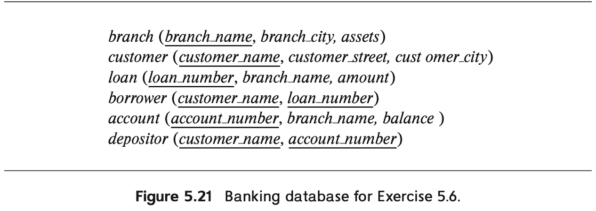
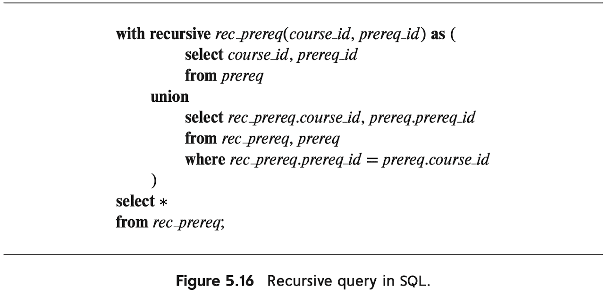

# Table of Contents
<details><summary>click to expand</summary>

* [5.5](#55) <br>
* [5.6](#56) <br>
* [5.7](#57) <br>
* [5.8](#58) <br>
* [5.9](#59) <br>
* [5.16](#516) <br>
* [5.19](#519) <br>
* [5.20](#520) <br>
* [5.21](#521) <br>
* [5.22](#522) <br>
* [5.23](#523) <br>

</details><br>

# 5.5

**Question**. Show how to enforce the constraint "an instructor cannot teach two different sections in a semester in the same time slot." using a trigger (remember that the constraint can be violated by changes to the <code>teaches</code> relation as well as to the <code>section</code> relation).

<details><summary><strong>Answer</strong>. click to expand</summary>

```sql
CREATE TRIGGER teaches_constraint BEFORE UPDATE OF teaches
    REFERENCING NEW ROW AS nrow
    FOR EACH ROW
        WHEN EXISTS (
            SELECT time_slot_id 
            FROM teaches
            NATURAL JOIN section
            WHERE ID = nrow.ID
        ) INTERSECT (
            SELECT time_slot_id 
            FROM section
            WHERE course_id = nrow.course_id AND
                sec_id = nrow.sec_id AND
                semester = nrow.semester AND
                year = nrow.year AND
        )
        BEGIN ATOMIC 
            ROLLBACK
        END

CREATE TRIGGER section_constraint BEFORE UPDATE OF section
    REFERENCING NEW ROW AS nrow
    FOR EACH ROW
        WHEN nrow.time_slot_id IN (
            SELECT time_slot_id 
            FROM section
            NATURAL JOIN teaches
            WHERE ID = (
                SELECT ID
                FROM section
                NATURAL JOIN teaches
                WHERE course_id = nrow.course_id AND
                    sec_id = nrow.sec_id AND
                    semester = nrow.semester AND
                    year = nrow.year AND
            )
        )
        BEGIN ATOMIC 
            ROLLBACK
        END
```

</details><br>

# 5.6

**Question**. Consider the bank database of Figure 5.21. Let us define a view <code>branch_cust</code> as follows: 

```sql
CREATE VIEW branch_cust AS 
    SELECT branch_name, customer_name
    FROM depositor, account
    WHERE depositor.account_number = account.account_number
```

<p align = "center">
    
</p><br>

Suppose that the view is <strong>materialized</strong>; that is, the view is computed and stored. Write triggers to maintain the view, that is, to keep it up-to-date on insertions to <code>depositor</code> or <code>account</code>. It is not necessary to handle deletions or updates. Note that, for simplicity, we have not required the elimination of duplicates.

<details><summary><strong>Answer</strong>. click to expand</summary>

```sql
CREATE TRIGGER up_to_date_depositor AFTER INSERT OF depositor
    REFERENCING NEW ROW AS nrow
    FOR EACH ROW
        WHEN nrow.customer_name NOT IN 
            SELECT customer_name
            FROM branch_cust
            WHERE branch_cust.branch_name = (
                SELECT branch_name
                FROM account
                WHERE account_number = nrow.account_number
            )
        BEGIN ATOMIC
            INSERT INTO branch_cust
                SELECT branch_name, nrow.customer_name
                FROM account
                WHERE account_number = nrow.account_number
        END

CREATE TRIGGER up_to_date_account AFTER INSERT OF account
    REFERENCING NEW ROW AS nrow
    FOR EACH ROW
        WHEN (nrow.branch_name, (SELECT customer_name FROM depositor WHERE account_number = nrow.account_number)) NOT IN branch_cust
        BEGIN ATOMIC
            INSERT INTO branch_cust
                (nrow.branch_name, (SELECT customer_name FROM depositor WHERE account_number = nrow.account_number))
        END
```

Or, if the duplicates are allowed, we can just simply insert the tuple for every statement:

```sql
CREATE TRIGGER insert_into_branch_cust_via_depositor AFTER INSERT ON depositor 
    REFERENCING NEW ROW AS inserted 
    FOR EACH STATEMENT
        INSERT INTO branch_cust
            SELECT branch_name, inserted.customer_name FROM account WHERE inserted.account_number = account.account_number

CREATE TRIGGER insert_into_branch_cust_via_account AFTER INSERT ON account 
    REFERENCING NEW ROW AS inserted 
    FOR EACH STATEMENT 
        INSERT INTO branch_cust
            SELECT inserted.branch_name, customer_name FROM depositor
            WHERE depositor.account_number = inserted.account_number
```

</details><br>

# 5.7

**Question**. Consider the bank database of Figure 5.21. Write an SQL trigger to carry out the following action: On <code>DELETE</code> of an account, for each customer-owner of the account, check if the owner has any remaining accounts, and if she does not, delete her from the <code>depositor</code> relation.

<details><summary><strong>Answer</strong>. click to expand</summary>

```sql
CREATE TRIGGER delete_depositor AFTER DELETE OF account
    REFERENCING OLD ROW AS orow
    FOR EACH ROW 
    DELETE FROM depositor
    WHERE depositor.customer_name NOT IN (
        SELECT customer_name 
        FROM depositor
        WHERE orow.account_number <> account_number
    )
```

</details><br>

# 5.8

**Question** Given a relation <code>S(student, subject, marks)</code>, write a query to find the top 10 students by total marks, by using SQL ranking. Include all students tied for the final spot in the ranking, even if that results in more than 10 total students.

<details><summary><strong>Answer</strong>. click to expand</summary>

```sql
SELECT * 
FROM (
    SELECT RANK () OVER (ORDER BY total_marks DESC) AS t_rank
    FROM (
        SELECT SUM (marks) AS total_marks
        FROM S
        GROUP BY student
    )
)
WHERE t_rank <= 10
```

</details><br>

# 5.9

**Question**. Given a relation <code>nyse(year, month, day, shares_traded, dollar_volume)</code> with trading data from the New York Stock Exchange, list each trading day in order of number of shares traded, and show each day’s rank.

<details><summary><strong>Answer</strong>. click to expand</summary>

```sql
SELECT year, month, day, shares_traded, RANK () OVER (ORDER BY shares_traded DESC) AS day_rank
FROM nyse
ORDER BY shares_traded DESC
```

</details><br>

# 5.16

**Question**. Consider an employee database with two relations

$$
\begin{aligned}
    & \textrm{part} (\underline{\textrm{part}\_{-}\textrm{id}}, \textrm{ name}, \textrm{ cost}) \\
    & \textrm{subpart} (\underline{\textrm{part}\_{-}\textrm{id}}, \underline{\textrm{ subpart}\_{-}\textrm{id}}, \textrm{ count}) \\
\end{aligned}
$$

where the primary-key attributes are underlined. A tuple $`(p_1, p_2, 3)$ in the <code>subpart</code> relation denotes that the part with <code>part_id</code> $`p_2`$, is a direct subpart of the part with <code>part_id</code> $`p_1`$, and $`p_1`$, has 3 copies of $`p_2`$. Note that $`p_2`$ may itself have further subparts. Write a recursive SQL query that outputs the names of all subparts of the part with part-id 'P-100'.

<details><summary><strong>Answer</strong>. click to expand</summary>

```sql
WITH RECURSIVE all_subparts_of_P100 (part_id, name) AS (
        SELECT subpart_id, name 
        FROM subpart 
            /* Concatenate the name of subpart */
            INNER JOIN part ON subpart.subpart_id = part.part_id
        WHERE part_id = 'P-100'
    UNION 
    SELECT subpart.subpart_id, part.name
    FROM all_subparts_of_P100, 
         subpart INNER JOIN part ON subpart.subpart_id = part.part_id
    WHERE all_subparts_of_P100.part_id = subpart.part_id
) 
```

</details><br>

# 5.19

**Question**. Suppose there are two relations $`r`$ and $`s`$, such that the foreign key $`B`$ of $`r`$ references the primary key $`A`$ of $`s`$. Describe how the trigger mechanism can be used to implement the <code>ON DELETE CASCADE</code> option when a tuple is deleted from $`s`$.


<details><summary><strong>Answer</strong>. click to expand</summary>

> Construct the following trigger: when any row of $`s`$ is deleted (let <code>orow</code>), traverse the entire relation $`r`$ and delete tuples of $`r`$ of which key $`B`$ is referencing $`A`$ of <code>orow</code>: 

```sql
CREATE TRIGGER cascading_delete AFTER UPDATE OF s
    REFERENCING OLD ROW AS orow
    FOR EACH ROW
    BEGIN ATOMIC 
        DELETE FROM r
        WHERE B = orow.A
    END;
```

</details><br>

# 5.20

**Question**. The execution of a trigger can cause another action to be triggered. Most database systems place a limit on how deep the nesting can be. Explain why they might place such a limit.

<details><summary><strong>Answer</strong>. click to expand</summary>

> The trigger can accidentally trigger infinite chain of other triggers. 

</details><br>

# 5.21

**Question**. Modify the recursive query in Figure 5.16 to define a relation

$$
\begin{aligned}
    \textrm{prereq}\_{-}\textrm{depth} (\textrm{course}\_{-}\textrm{id}, \textrm{ prereq}\_{-}\textrm{id}, \textrm{ depth})
\end{aligned}
$$

where the attribute <code>depth</code> indicates how many levels of intermediate prerequisites there are between the course and the prerequisite. Direct prerequisites have a depth of O. Note that a prerequisite course may have multiple depths and thus may appear more than once.


<p align = "center">
    
</p><br>

<details><summary><strong>Answer</strong>. click to expand</summary>

```sql
WITH RECURSIVE AS prereq_depth (course_id, prereq_id, depth) AS 
        SELECT course_id, prereq_id, 0
        FROM prereq
    UNION
        SELECT prereq_depth.course_id, prereq.prereq_id, depth + 1
        FROM prereq_depth INNER JOIN prereq
            ON prereq_depth.prereq_id = prereq.id
```

</details><br>

# 5.22

**Question**. Given relation $`s(a, b, c)`$, write an SQL statement to generate a histogram showing the sum of $`c`$ values versus $`a`$, dividing $`a`$ into 20 equal-sized partitions (i.e., where each partition contains 5 percent of the tuples in $`s`$, sorted by $`a`$).

<details><summary><strong>Answer</strong>. click to expand</summary>

```sql
WITH hist (a, b, c, idx) AS (
    SELECT *, NTILE (20) OVER (ORDER BY a ASC)
    FROM s
)
SELECT idx, SUM (c)
FROM hist
GROUP BY idx
ORDER BY idx
```
</details><br>

# 5.23

**Question**. Consider the <em>nyse</em> relation of Exercise 5.9. For each month of each year, show the total monthly dollar volume and the average monthly dollar volume for that month and the two prior months. (<em>Hint</em>: First write a query to find the total dollar volume for each month of each year. Once that is right, put that in the from clause of the outer query that solves the full problem. That outer query will need windowing. The subquery does not.)

<details><summary><strong>Answer</strong>. click to expand</summary>

```sql
WITH nyse_with_month (year, month, shares_traded, dollar_volume) AS (
    SELECT year, month, SUM (shares_traded), SUM (dolloar_volume)
    FROM nyse
    GROUP BY year, month
)
SELECT dolloar_volume, 
    AVG (dollar_volume) OVER (
        ORDER BY month ASC
        ROWS BETWEEN 2 PRECEDING AND CURRENT ROW)
FROM nyse_with_month
GROUP BY year
ORDER BY year ASC
```

Or, query without <code>GROUP BY</code> is also possible:

```sql
WITH nyse_with_month (year, month, shares_traded, dollar_volume) AS (
    SELECT year, month, SUM (shares_traded), SUM (dolloar_volume)
    FROM nyse
    GROUP BY year, month
)
SELECT dolloar_volume, 
    AVG (dollar_volume) OVER (
        ORDER BY year ASC, month ASC
        ROWS BETWEEN 2 PRECEDING AND CURRENT ROW)
FROM nyse_with_month
```

</details><br>
