# Table of Contents
<details><summary>click to expand</summary>

* [6.1](#61) <br>
* [6.2](#62) <br>
* [6.3](#63) <br>
* [6.4](#64) <br>
* [6.5](#65) <br>
* [6.6](#66) <br>
* [6.7](#67) <br>
* [6.8](#68) <br>
* [6.9](#69) <br>
* [6.10](#610) <br>
* [6.11](#611) <br>
* [6.12](#612) <br>

* [6.14](#614) <br>
* [6.15](#615) <br>
* [6.16](#616) <br>
* [6.17](#617) <br>
* [6.18](#618) <br>
* [6.19](#619) <br>
* [6.20](#620) <br>
* [6.21](#621) <br>

* [6.23](#623) <br>
* [6.24](#624) <br>
* [6.25](#625) <br>
* [6.26](#626) <br>
* [6.27](#627) <br>
* [6.28](#628) <br>

</details><br>

# 6.1

**Question**. Construct an E-R diagram for a car insurance company whose customers own one or more cars each. Each car has associated with it zero to any number of recorded accidents. Each insurance policy covers one or more cars and has one or more premium payments associated with it. Each payment is for a particular period of time, and has an associated due date, and the date when the payment was received.

<details><summary><strong>Answer</strong>. click to expand</summary>

<p align = "center">
    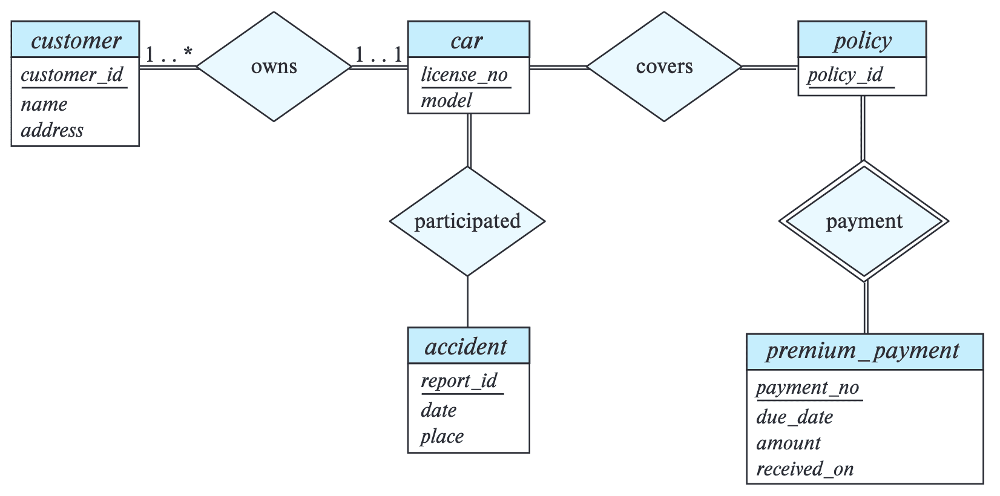
</p><br>

</details><br>

# 6.2

**Question**. Consider a database that includes the entity sets student, course, and section from the university schema and that additionally records the marks that students receive in different exams of different sections.

    a. Construct an E-R diagram that models exams as entities and uses a ternary relationship as part of the design.

    b. Construct an alternative E-R diagram that uses only a binary relationship between student and section. Make sure that only one relationship exists between a particular student and section pair, yet you can represent the marks that a student gets in different exams.

<details><summary><strong>Answer</strong>. click to expand</summary>

> **a.**

<p align = "center">
    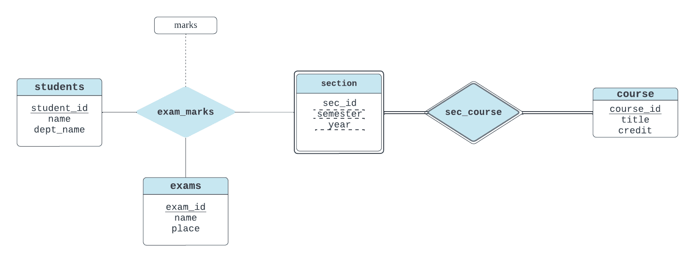
</p><br>

> **b.**

<p align = "center">
    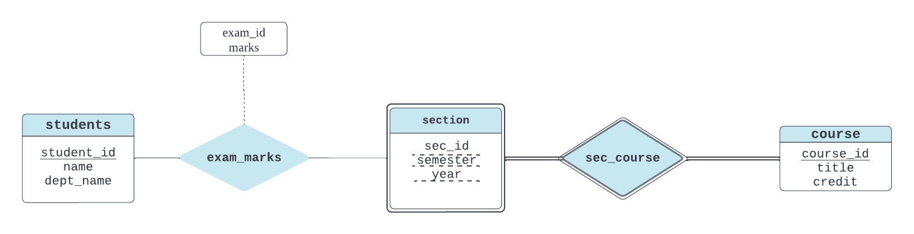
</p><br>

</details><br>

# 6.3

**Question**. Design an E-R diagram for keeping track of the scoring statistics of your favorite sports team. You should store the matches played, the scores in each match, the players in each match, and individual player scoring statistics for each match. Summary statistics should be modeled as derived attributes with an explanation as to how they are computed.

<details><summary><strong>Answer</strong>. click to expand</summary>

<p align = "center">
    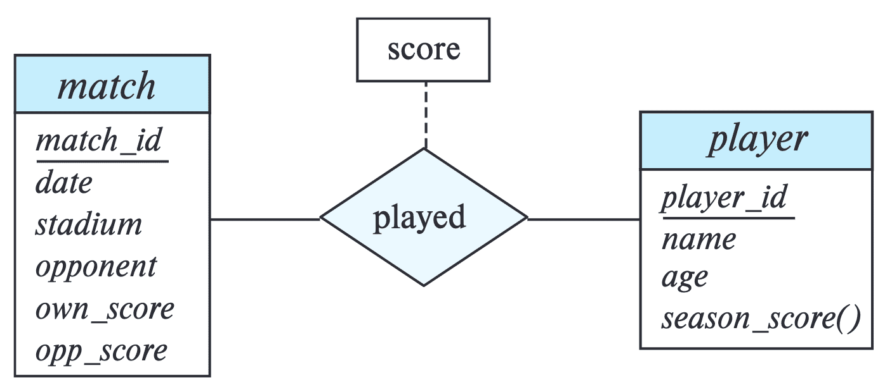
</p><br>

</details><br>

# 6.4

**Question** Consider an E-R diagram in which the same entity set appears several times, with its attributes repeated in more than one occurrence. Why is allowing this redundancy a bad practice that one should avoid?

<details><summary><strong>Answer</strong>. click to expand</summary>

> Such redundancy can lead to integrity issues. If data is duplicated across multiple places and one copy is updated but another isn't, it can result in contradictory or incorrect information. This undermines the reliability of the data. 

</details><br>

# 6.5

**Question** An E-R diagram can be viewed as a graph. What do the following mean in terms of the structure of an enterprise schema?

    a. The graph is disconnected.
    b. The graph has a cycle.

<details><summary><strong>Answer</strong>. click to expand</summary>

Note that a path in the graph between a pair of entity sets indicates a (possibly indirect) relationship between the two entity sets.

> **a.** A disconnected graph implies that there are pairs of entity sets that are unrelated to each other. In an enterprise, we can say that the two parts of the enterprise are completely independent of each other. If we split the graph into connected components, we have, a separate database corresponding to each independent independent part of the enterprise.

> **b.** If there is a cycle in the graph, then every pair of entity sets on the cycle are related to each other in at least two distinct ways. If the E-R diagram is acyclic, then there is unique path between every pair of entity sets and thus a unique relationship between every pair of entity sets.

</details><br>

# 6.6

**Question**. Consider the representation of the ternary relationship of Figure 6.29a using the binary relationships illustrated in Figure 6.29b (attributes not shown).

    a. Show a simple instance of $`E`$, $`A`$, $`B`$, $`C`$, $`R_A`$, $`R_B`$, and $`R_C`$ that cannot correspond to any instance of $`A`$, $`B`$, $`C`$, and $`R`$.
    
    b. Modify the E-R diagram of Figure 6.29b to introduce constraints that will guarantee that any instance of $`E`$, $`A`$, $`B`$, $`C`$, $`R_A`$, $`R_B`$, and $`R_C`$ that satisfies the constraints will correspond to an instance of $`A`$, $`B`$, $`C`$, and $`R`$.
    
    c. Modify the preceding translation to handle total participation constraints on the ternary relationship. 

<p align = "center">
    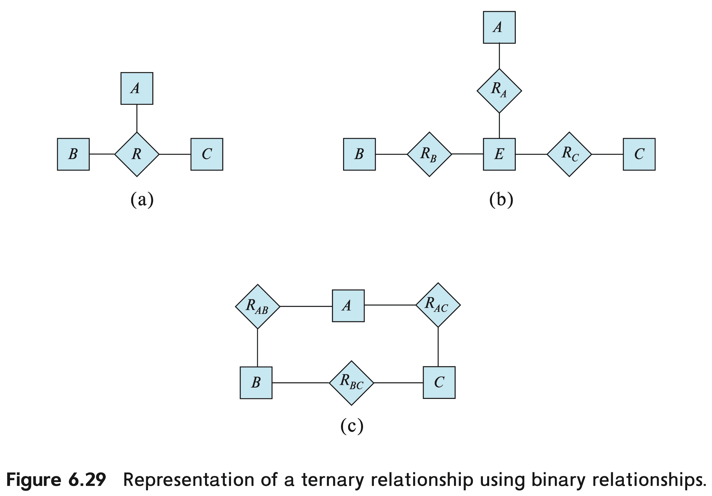
</p><br>

<details><summary><strong>Answer</strong>. click to expand</summary>

<strong>a.</strong> Let <code>E = {e1, e2}</code>, <code>A = {a1, a2}</code>, <code>B = {b1}</code>, <code>C = {c1}</code>, <code>R_A =
{(e1, a1), (e2, a2)}</code>, <code>R_B = {(e1 , b1)}</code>, and <code>R_C = {(e1 , c1)}</code>. We see that because of the tuple <code>(e2, a2)</code>, no instance of <code>A</code>, <code>B</code>, <code>C</code>, and <code>R</code> exists that corresponds to <code>E</code>, <code>R_A</code>, <code>R_B</code> and <code>R_C</code>. This is because the total participation of <code>E</code> to <code>R_A, R_B, R_C</code> is not guaranteed in the E-R diagram.

<strong>b.</strong> 

<p align = "center">
    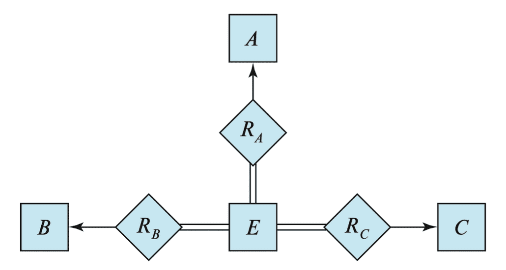
</p><br>

<strong>c.</strong> For instance, if <code>A</code> totally participates in the relationhip <code>R</code>, then we can just introduce a total participation constraint between <code>A</code> and <code>R_A</code>.

</details><br>

# 6.7

**Question**. A weak entity set can always be made into a strong entity set by adding to its attributes the primary-key attributes of its identifying entity set. Outline what sort of redundancy will result if we do so.

<details><summary><strong>Answer</strong>. click to expand</summary>

> Since the primary key of a weak entity set can be inferred from its strong identifying entity, the added primary key of a weak entity set will be also present in a strong entity set, thus redundancy occurs. 

</details><br>

# 6.8

**Question**. Consider a relation such as <code>sec_course</code>, generated from a many-to-one relationship set <code>sec_course</code>. Do the primary and foreign key constraints created on the relation enforce the many-to-one cardinality constraint? Explain why.

<details><summary><strong>Answer</strong>. click to expand</summary>

> Yes. The primary key of <code>section</code> consists of the attributes <code>(course_id, sec_id, semester, year)</code> which would also be the primary key of <code>sec_course</code>, while <code>course_id</code> is a foreign key from <code>sec_course</code> referencing <code>course</code>. These constraints ensure that a particular section can only correspond to one course, and thus the many-to-one cardinality constraint is enforced.

</details><br>

# 6.9

**Question**. Suppose the <code>advisor</code> relationship set were one-to-one. What extra constraints are required on the relation <code>advisor</code> to ensure that the one-to-one cardinality constraint is enforced?

<details><summary><strong>Answer</strong>. click to expand</summary>

> Note that the primary key of <code>instructor</code> and <code>student</code> relations are both <code>id</code> and the relation <code>advisor</code> concatenates two relations with attributes <code>(s_id, i_id)</code>. If only one attribute forms a superkey, one-to-one cardinality cannot be enforced. For example, if <code>s_id</code> is the only primary key, since distinct <code>s_id</code>s are enough to satisfy the constraint, the simulataneous existence of <code>(s_id = 3, i_id = 2)</code> and <code>(s_id = 1, i_id = 2)</code> is not a violation. Hence, both attributes should form a superkey, i.e. have <code>UNIQUE</code> constraint in SQL. 

</details><br>

# 6.10

**Question**. Consider a many-to-one relationship $`R`$ between entity sets $`A`$ and $`B`$. Suppose the relation created from $`R`$ is combined with the relation created from $`A`$. In SQL, attributes participating in a foreign key constraint can be <code>NULL</code>. Explain how a constraint on total participation of $`A`$ in $`R`$ can be enforced using <code>NOT NULL</code> constraints in SQL.

<details><summary><strong>Answer</strong>. click to expand</summary>

> The foreign-key attribute in $`R`$ corresponding to the primary key of $`B`$ should be made <code>NOT NULL</code>. Then, suppose that a tuple <code>t</code> in $`A`$ has no corresponding entry in $R$. This implies when $R$ is combined with $A$, it would have a foreign-key attribute referencing to $`B`$ as <code>NULL</code>, which violates our constraint.

</details><br>

# 6.11

**Question**. In SQL, foreign key constraints can reference only the primary key attributes of the referenced relation or other attributes declared to be a superkey using the <code>UNIQUE</code> constraint. As a result, total participation constraints on a many-to-many relationship set (or on the "one" side of a one-to-many relationship set) cannot be enforced on the relations created from the relationship set, using primary key, foreign key, and not null constraints on the relations.

    a. Explain why.

    b. Explain how to enforce total participation constraints using complex check constraints or assertions (see Section 4.4.8). (Unfortunately, these features are not supported on any widely used database currently.)

<details><summary><strong>Answer</strong>. click to expand</summary>

> **a.** For the many-to-many case, the relationship set must be represented as a separate relation that cannot be combined with either participating entity. Now, there is no way in SQL to ensure that a primary-key value occuring in an entity $E_1$ also occurs in a many-to-many relationship $R$ by designating primary-key in $E_1$ as a foreign key referring that in $R$, since the corresponding attribute in $R$ is not unique; SQL foreign keys can only refer to the primary key or some other unique key. 

Similary, for the one-to-many case, there is no way to ensure that an attribute on the one side appears in the relation corresponding to the many side, for the same reason.

> **b.**

```sql
CREATE ASSERTION total_part CHECK (b IN (SELECT b FROM A));
SET CONSTRAINT total_part DEFERRED;
```

</details><br>

# 6.12

**Question**. Consider the following lattice structure of generalization and specialization (attributes are not shown).

<p align = "center">
    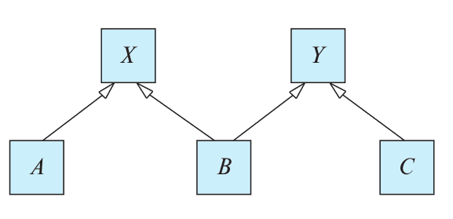
</p><br>

For entity sets $A$, $B$, and $C$, explain how attributes are inherited from the higher level entity sets $X$ and $Y$. Discuss how to handle a case where an attribute of $X$ has the same name as some attribute of $Y$.

<details><summary><strong>Answer</strong>. click to expand</summary>

> $A$ inherits all the attributes of $X$, plus it may define its own attributes. Similarly, $C$ inherits all the attributes of $Y$ plus its own attributes. $B$ inherits the attributes of both $X$ and $Y$. If there is some attribute _name_ which belongs to both $X$ and $Y$, it may be referred to in $B$ by the qualified name $X$._name_ or $Y$._name_.

</details><br>

# 6.13

**Question**. An E-R diagram usually models the state of an enterprise at a point in time. Suppose we wish to track temporal changes, that is, changes to data over time. For example, Zhang may have been a student between September 2015 and May 2019, while Shankar may have had instructor Einstein as advisor from May 2018 to December 2018, and again from June 2019 to January 2020. Similary, attribute values of an entity or relationship, such as title and credits of course, salary, or even name of instructor, and tot_cred of student, can change over time.
One way to model temporal changes is as follows: We define a new data type called <strong>valid_time</strong>, which is a time interval, or a set of time intervals. We then associate a valid_time attribute with each entity and relationship, recording the time periods during which the entity or relationship is valid. The end time of an interval can be infinity; for example, if Shankar became a student in September 2018, and is still a student, we can represent the end time of the valid_time interval as infinity for the Shankar entity. Similarly, we model attributes that can change over time as a set of values, each with its own valid_time.

    a. Draw an E-R diagram with the student and instructor entities, and the advisor relationship, with the above extensions to track temporal changes.

    b. Convert the E-R diagram discussed above into a set of relations.

It should be clear that the set of relations generated is rather complex, leading to difficulties in tasks such as writing queries in SQL. An alternative approach, which is used more widely, is to ignore temporal changes when designing the E-R model (in particular, temporal changes to attribute values), and to modify the relations generated from the E-R Model to track temporal changes.

<details><summary><strong>Answer</strong>. click to expand</summary>

<p align = "center">
    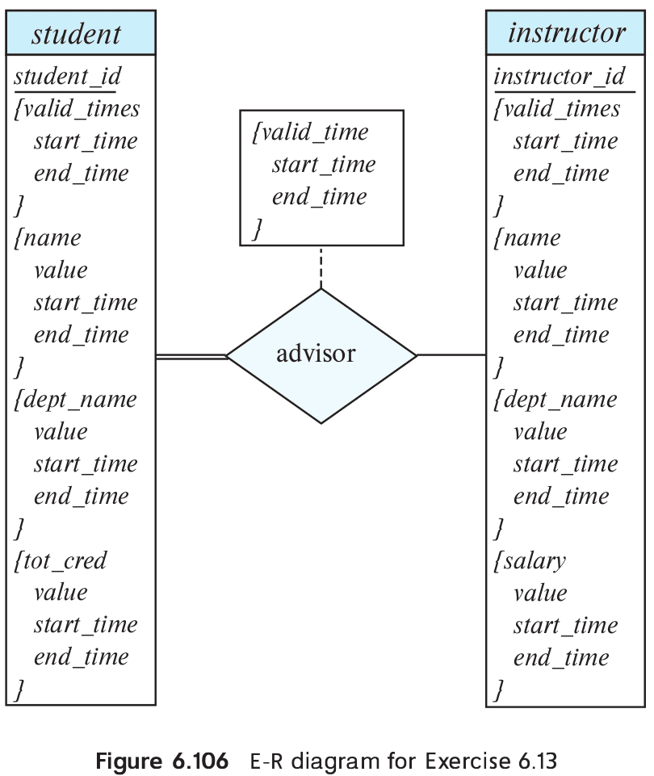
</p><br>
<p align = "center">
    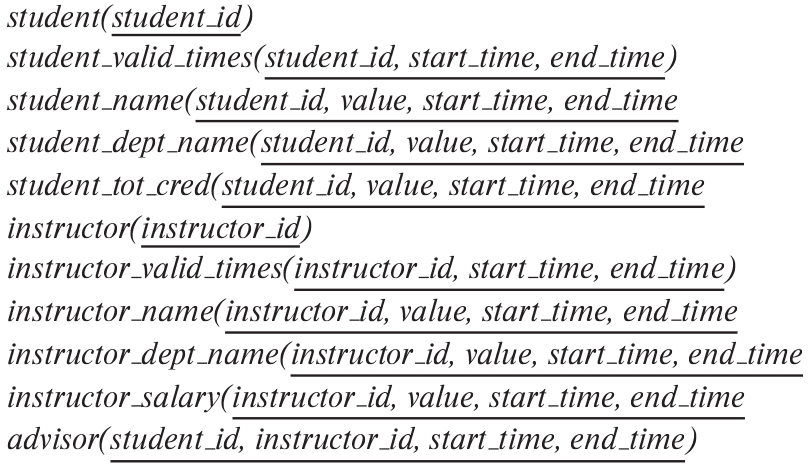
</p><br>

</details><br>

# 6.14

**Question**. Explain the distinctions among the terms *primary key*, *candidate key*, and *superkey*.

<details><summary><strong>Answer</strong>. click to expand</summary>

> A <strong>primary key</strong> is a chosen candidate key that uniquely identifies each record in a table and cannot contain <code>NULL</code> values. A <strong>candidate key</strong> is any column or set of columns that can uniquely identify a record, with no redundant attributes. A <strong>superkey</strong> is a set of columns that can uniquely identify a record, potentially including extra, unnecessary attributes; all candidate keys are superkeys, but not all superkeys are candidate keys.

</details><br>

# 6.15

**Question**. Construct an E-R diagram for a hospital with a set of patients and a set of medical doctors. Associate with each patient a log of the various tests and examinations conducted.

<details><summary><strong>Answer</strong>. click to expand</summary>

<p align = "center">
    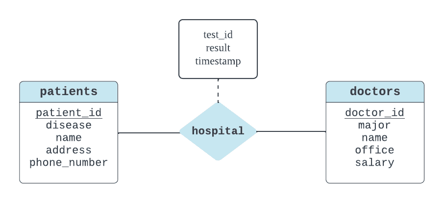
</p><br>

</details><br>

# 6.16

**Question**. Extend the E-R diagram of Exercise 6.3 to track the same information for all teams in a league.

<details><summary><strong>Answer</strong>. click to expand</summary>

<p align = "center">
    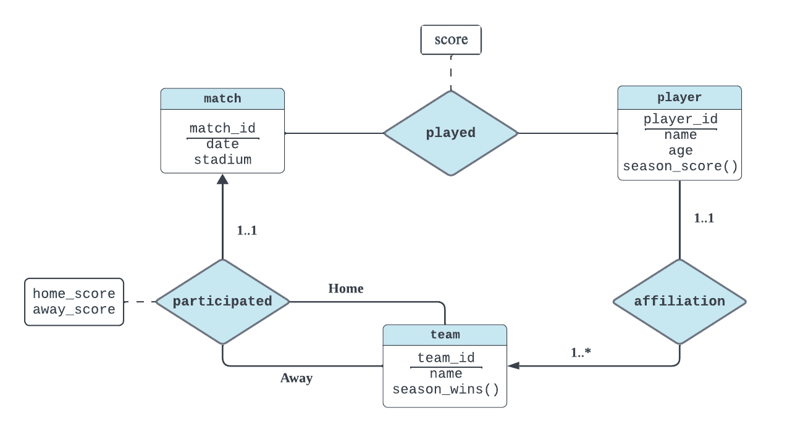
</p><br>

</details><br>

# 6.17

**Question**. Explain the difference between a weak and a strong entity set.

<details><summary><strong>Answer</strong>. click to expand</summary>

> A strong entity set can exist on its own, whereas an existence of weak entity set is dependent on its identifying entity set. 

</details><br>

# 6.18

**Question**. Consider two entity sets $A$ and $B$ that both have the attribute $X$ (among others whose names are not relevant to this question).

a. If the two $X$s are completely unrelated, how should the design be improved?

b. If the two $X$s represent the same property and it is one that applies both
to $A$ and to $B$, how should the design be improved? Consider three subcases: 

* $X$ is the primary key for $A$ but not $B$
* $X$ is the primary key for both $A$ and $B$
* $X$ is not the primary key for $A$ nor for $B$

<details><summary><strong>Answer</strong>. click to expand</summary>

<strong>a.</strong> 

<strong>b.</strong>

</details><br>

# 6.19

**Question**. We can convert any weak entity set to a strong entity set by simply adding appropriate attributes. Why, then, do we have weak entity sets?

<details><summary><strong>Answer</strong>. click to expand</summary>

> Weak entity sets are useful to discard redundancy of attributes when a entity set is dependent on other entity sets, and also explicity represent it on E-R diagram. 

</details><br>

# 6.20

**Question**. Construct appropriate relation schemas for each of the E-R diagrams in:

a. Exercise 6.1
b. Exercise 6.2.
c. Exercise 6.3.
d. Exercise 6.15. 

<details><summary><strong>Answer</strong>. click to expand</summary>

> **a.** 

<code>customer (customer_id, name, address)</code>
<code>car(license_no, model, customer_id)</code>
<code>accident(report_id, date, place)</code>
<code>participated(license_no, report_id)</code>
<code>policy(policy_id)</code>
<code>covers(license_no, policy_id)</code>
<code>premium_payment(policy_id,payment_no,due_date,amount,received_no)</code>

> **b.** 

<code>students (student_id, name, dept_name)</code>
<code>car(license_no, model, customer_id)</code>
<code>exams(exam_id, name, place)</code>
<code>exam_marks(exam_id, student_id, course_id, sec_id, semester, year, marks)</code>
<code>section(course_id, sec_id, semester, year)</code>
<code>course(course_id, title, credit)</code>

> **c.** 

<code>matches (match_id, date, score, opp_score, place)</code>
<code>players (player_id, name, age, season_score)</code>
<code>played (match_id, player_id, score)</code>

> **d.** 

<code>patients (patient_id, disease, name, address, phone_number)</code>
<code>doctors (doctor_id, major, name, office, salary)</code>
<code>hospital (patient_id, doctor_id, test_id, result, timestamp)</code>

</details><br>

# 6.21

**Question**. Consider the E-R diagram in Figure 6.30, which models an online bookstore.

<p align = "center">
    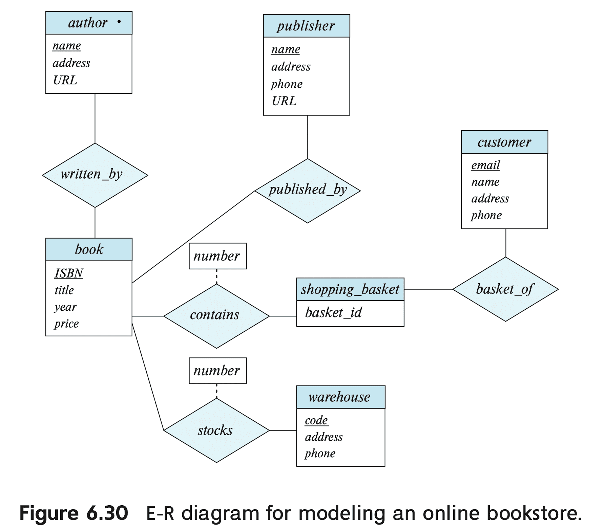
</p><br>

a. Suppose the bookstore adds Blu-ray discs and downloadable video to its collection. The same item may be present in one or both formats, with differing prices. Draw the part of the E-R diagram that models this addition, show just the parts related to video.

b. Now extend the full E-R diagram to model the case where a shopping basket may contain any combination of books, Blu-ray discs, or downloadable video.

<details><summary><strong>Answer</strong>. click to expand</summary>

<strong>a.</strong>

<p align = "center">
    
</p><br>

<strong>b.</strong>

<p align = "center">
    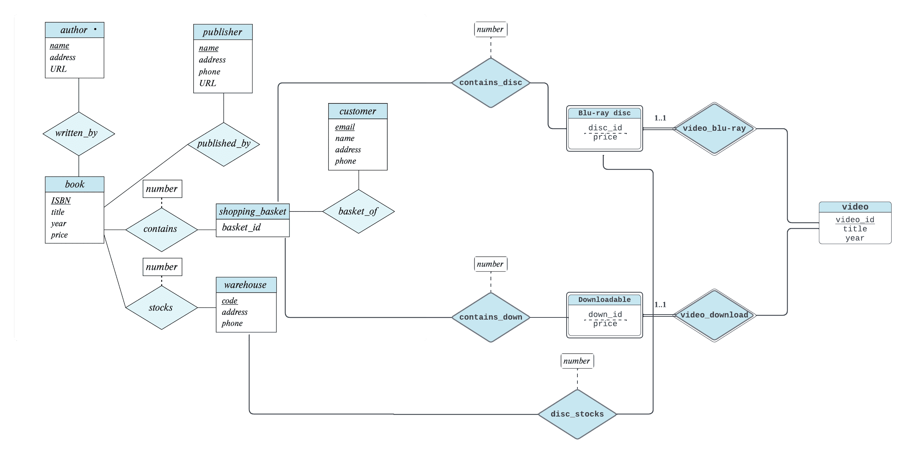
</p><br>

</details><br>

# 6.22

**Question**. Design a database for an automobile company to provide to its dealers to assist them in maintaining customer records and dealer inventory and to assist sales staff in ordering cars.
Each vehicle is identified by a vehicle identification number (VIN). Each individual vehicle is a particular model of a particular brand offered by the company (e.g., the XF is a model of the car brand Jaguar of Tata Motors). Each model can be offered with a variety of options, but an individual car may have only some (or none) of the available options. The database needs to store information about models, brands, and options, as well as information about individual dealers, customers, and cars.
Your design should include an E-R diagram, a set of relational schemas, and a list of constraints, including primary-key and foreign-key constraints.

<details><summary><strong>Answer</strong>. click to expand</summary>

<p align = "center">
    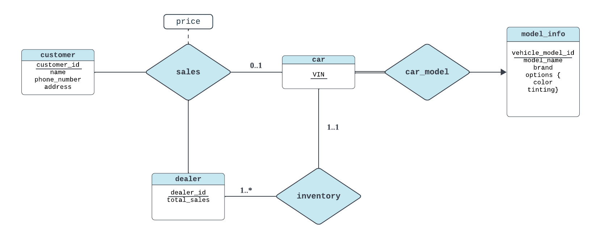
</p><br>

* <code>customer (<strong>customer_id</strong>, name, phone_number, address)</code>
* <code>dealer (<strong>dealer_id</strong>, total_sales)</code>
* <code>car (<strong>VIN</strong>, vehicle_model_id, dealer_id)</code>
* <code>sales (<strong>customer_id</strong>, <strong>dealer_id</strong>, <strong>VIN</strong>, price)</code>
* <code>car_model (<strong>vehicle_model_id</strong>, model_name, brand, color, tilting)</code>

</details><br>

# 6.23

**Question**. Design a database for a worldwide package delivery company (e.g., DHL or FedEx). The database must be able to keep track of customers who ship items and customers who receive tiems; some customers may do both. Each package must be identifiable and trackable, so the database must be able to store the location of the package and its history of locations. Locations include trucks, planes, airports, and warehouses.
Your design should include an E-R diagram, a set of relational schemas, and a list of constraints, including primary-key and foreign-key constraints.

<details><summary><strong>Answer</strong>. click to expand</summary>

<p align = "center">
    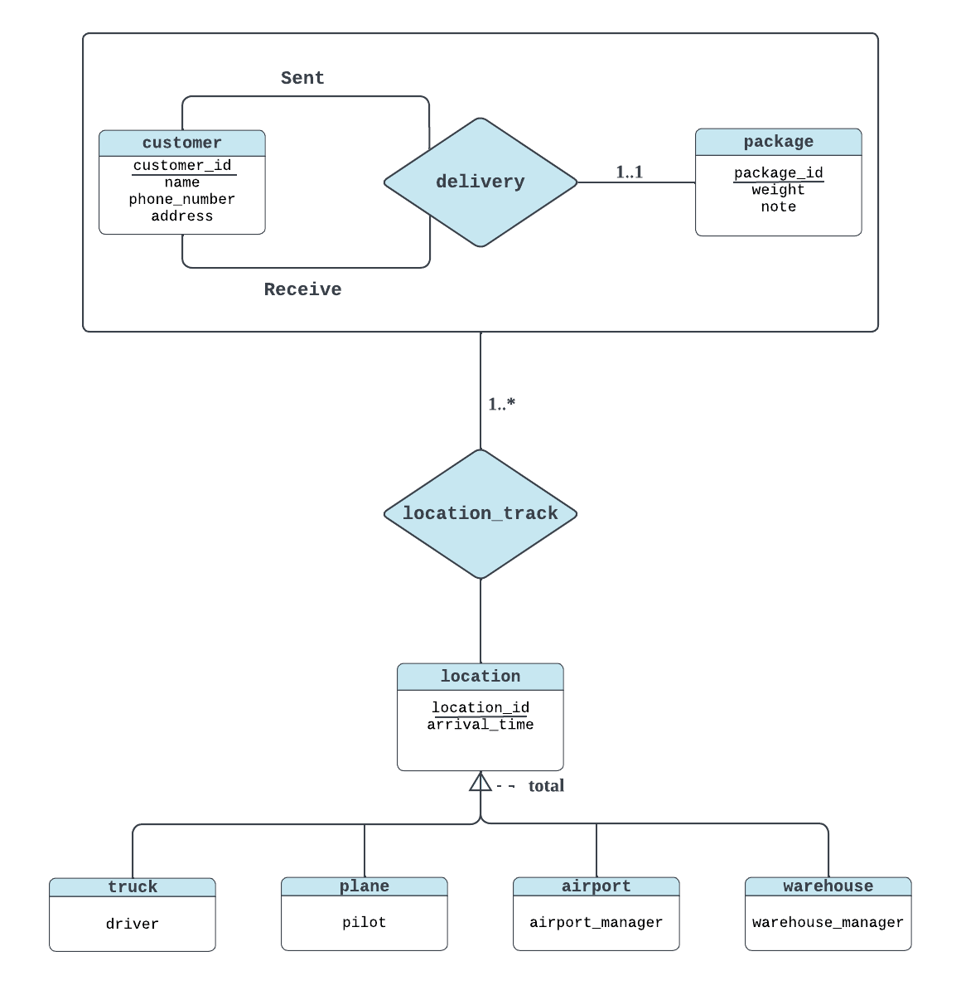
</p><br>

* <code>customer (<strong>customer_id</strong>, name, phone_number, address)</code>
* <code>package (<strong>package_id</strong>, weight, note, sent_id, receive_id)</code>
* <code>location (<strong>location_id</strong>, arrival_time)</code>
* <code>package_location (<strong>package_id</strong>, <strong>location_id</strong>)</code>
* <code>truck (<strong>location_id</strong>, truck_driver)</code>
* <code>plane (<strong>location_id</strong>, plane_pilot)</code>
* <code>airport (<strong>location_id</strong>, airport_manager)</code>
* <code>warehouse (<strong>location_id</strong>, warehouse_manager)</code>

</details><br>

# 6.24

**Question**. Design a database for an airline. The database must keep track of customers and their reservations, flights and their status, seat assignments on individual flights, and the schedule and routing of future flights. Your design should include an E-R diagram, a set of relational schemas, and a list of constraints, including primary-key and foreign-key constraints.

<details><summary><strong>Answer</strong>. click to expand</summary>

<p align = "center">
    
</p><br>

* <code>customer (<strong>customer_id</strong>, name, phone_number, address)</code>
* <code>flight (<strong>flight_id</strong>, src, dest, time_src, time_dst)</code>
* <code>reservation (<strong>customer_id</strong>, <strong>flight_id</strong>, seat_assignment)</code>

</details><br>

# 6.25

**Question**. In Section 6.9.4, we represented a ternary relationship (repeated in Figure 6.29a) using binary relationships, as shown in Figure 6.29b. Consider the alternative shown in Figure 6.29c. Discuss the relative mertis of these two alternative representations of a ternary relationship by binary relationships.

<p align = "center">
    
</p><br>

<details><summary><strong>Answer</strong>. click to expand</summary>

> The alternative shown in Figure 6.29c reduces the complexity of the diagram of Figure 6.29c by avoiding new entity set $E$.

</details><br>

# 6.26

**Question**. Design a generalization-specialization hierarchy for a motor vehicle sales company. The company sells motorcycles, passenger cars, vans, and buses. Justify your placement of attributes at each level of the hierarchy. Explain why they should not be placed at a higher or lower level.

<details><summary><strong>Answer</strong>. click to expand</summary>

<p align = "center">
    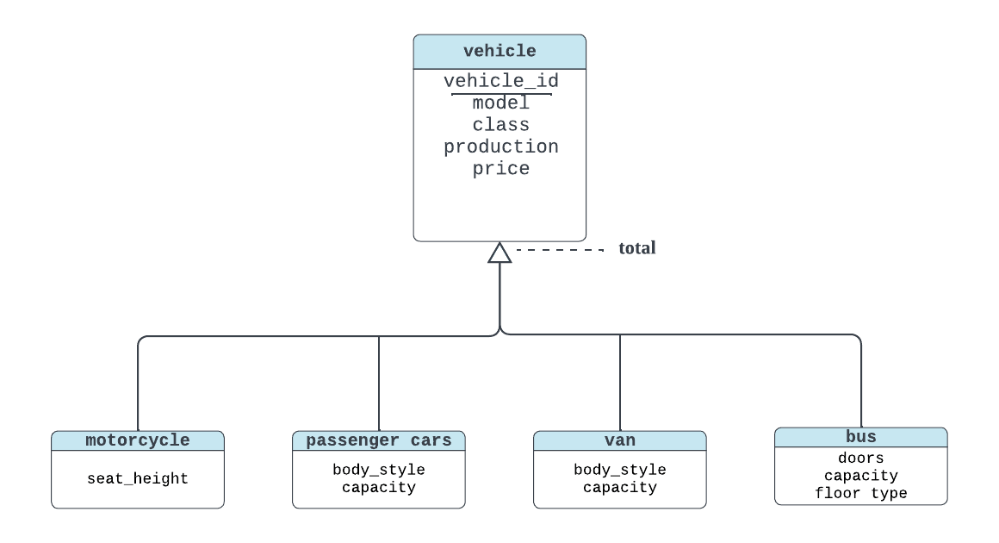
</p><br>

</details><br>

# 6.27

**Question**. Explain the distinction between disjoint and overlapping constraints.

<details><summary><strong>Answer</strong>. click to expand</summary>

> In specialization/generalization, <strong>disjoint constraints</strong> enforce the high-level entity set to be specialized into two disjoint low-level entity sets; an entity in high-level entity set cannot belong to multiple its low-level entity sets. <strong>Overlapping constraints</strong> do not.

</details><br>

# 6.28

**Question**. Explain the distinction between total and partial constraints.

<details><summary><strong>Answer</strong>. click to expand</summary>

> In specialization/generalization, <strong>total constraints</strong> enforce the high-level entity set to belong to at least one low-level entity set. <strong>Partial constraints</strong> do not.

</details><br>