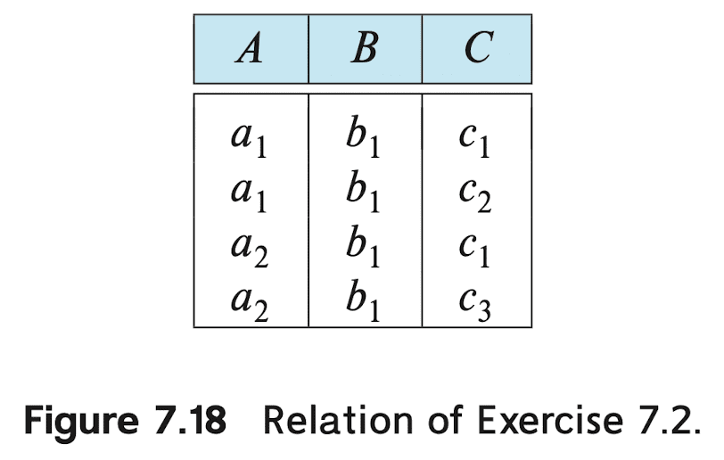
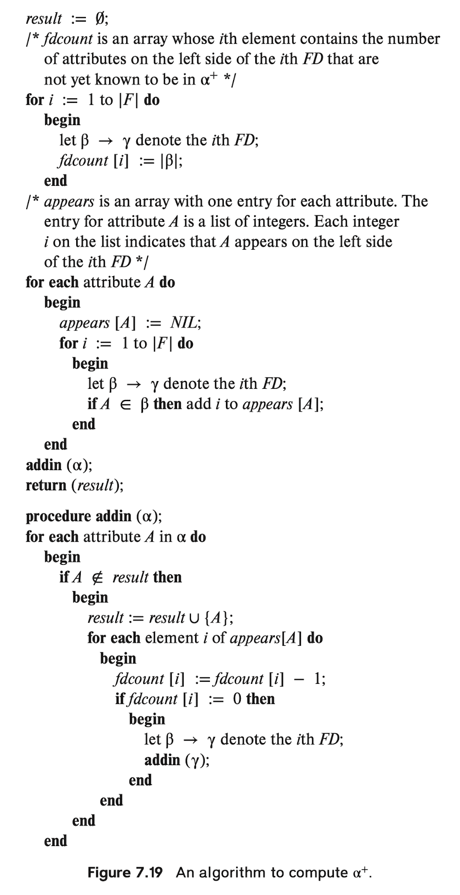

# Table of Contents
<details><summary>click to expand</summary>

* [7.1](#71) <br>
* [7.2](#72) <br>
* [7.3](#73) <br>
* [7.4](#74) <br>
* [7.5](#75) <br>
* [7.6](#76) <br>
* [7.7](#77) <br>
* [7.8](#78) <br>
* [7.9](#79) <br>
* [7.10](#710) <br>
* [7.11](#711) <br>
* [7.12](#712) <br>
* [7.13](#713) <br>
* [7.14](#714) <br>
* [7.15](#715) <br>
* [7.16](#716) <br>
* [7.17](#717) <br>
* [7.18](#718) <br>
* [7.19](#719) <br>
* [7.20](#720) <br>
* [7.21](#721) <br>
* [7.22](#722) <br>
* [7.23](#723) <br>
* [7.24](#724) <br>
* [7.25](#725) <br>
* [7.26](#726) <br>
* [7.27](#727) <br>
* [7.28](#728) <br>
* [7.29](#729) <br>
* [7.30](#730) <br>
* [7.31](#731) <br>
* [7.32](#732) <br>
* [7.33](#733) <br>
* [7.34](#734) <br>
* [7.35](#735) <br>
* [7.36](#736) <br>
* [7.37](#737) <br>
* [7.38](#738) <br>
* [7.39](#739) <br>
* [7.40](#740) <br>
* [7.41](#741) <br>
* [7.42](#742) <br>
* [7.43](#743) <br>
* [7.44](#744) <br>

</details><br>

# 7.1

**Question**. Suppose that we decompose the schema $R = (A, B, C, D, E)$ into 

$$
\begin{aligned}
    & (A, B, C) \\
    & (A, D, E).
\end{aligned}
$$

Show that this decomposition is a lossless decomposition if the following set $F$ of functional dependencies holds:

$$
\begin{aligned}
    & A \to BC \\
    & CD \to E \\
    & B \to D \\
    & E \to A
\end{aligned}
$$

<details><summary><strong>Answer</strong>. click to expand</summary>

Recall that the sufficient condition to be a lossless decomposition is that at least one of the following dependencies is in $F^+$:

$`
\begin{aligned}
    R_1 \cap R_2 \to R_1 \\
    R_1 \cap R_2 \to R_2
\end{aligned}
`$

Since $A \to ABC$ holds, given decompositions are lossless decomposition. 

</details><br>

# 7.2

**Question**. List all nontrivial functional dependencies satisfied by the relation of Figure 7.18.

<p align = "center">
    
</p><br>

<details><summary><strong>Answer</strong>. click to expand</summary>

$`
\begin{aligned}
    & C \to B \\
    & A \to B \\
    & AC \to B
\end{aligned}
`$

</details><br>

# 7.3

**Question**. Explain how functional dependencies can be used to indicate the following:

* A one-to-one relationship set exists between entity sets <code>student</code> and <code>instructor</code>.
* A many-to-one relationship set exists between entity sets <code>student</code> and <code>instructor</code>.

<details><summary><strong>Answer</strong>. click to expand</summary>

Let <code>s_id</code> and <code>i_id</code> be primary keys of <code>student</code> and <code>instructor</code>. 

<ul>
    <li><code>s_id → i_id</code> and <code>i_id → s_id</code> are sufficient. Then, pairs of tuple (<code>(a1, b1)</code>, <code>(a1, b2)</code>) and <code>(<code>(a1, b1)</code>, <code>(a2, b1)</code>)</code> are not viable.
    </li>
    <li><code>s_id → i_id</code> constraints tuples to be many-to-one.</li>
</ul>

</details><br>

# 7.4

**Question** Use Armstrong’s axioms to prove the soundness of the union rule. (<em>Hint</em>: Use the augmentation rule to show that, if $\alpha \to \beta$, then $\alpha \to \alpha\beta$. Apply the augmentation rule again, using $\alpha \to \gamma$, and then apply the transitivity rule.)

<details><summary><strong>Answer</strong>. click to expand</summary>

Assume $\alpha \to \beta$ and $\alpha \to \gamma$. By augmentation rule, $\beta \alpha \to \beta \gamma$ and $\alpha \to \beta \alpha$ hold. By transitivity rule, $\alpha \to \beta \gamma$ holds. This shows the soundness of union rule.

</details><br>

# 7.5

**Question** Use Armstrong’s axioms to prove the soundness of the pseudotransitivity rule.

<details><summary><strong>Answer</strong>. click to expand</summary>

Assume $\alpha \to \beta$ and $\gamma \beta \to \delta$. By augmentation rule, $\alpha \gamma \to \gamma \beta$ holds. By transitivity rule, $\alpha \gamma \to \delta$ holds. This shows the soundness of pseudotransitivity rule.

</details><br>

# 7.6

**Question**. Compute the closure of the following set $F$ of functional dependencies for relation schema $R = (A, B, C, D, E)$.

$$
\begin{aligned}
    & A \to BC \\
    & CD \to E \\
    & B \to D \\
    & E \to A
\end{aligned}
$$

<details><summary><strong>Answer</strong>. click to expand</summary>

First, we can find the non-trivial dependencies with single attribute in LHS: <code>A → B, A → C, A → D, A → E, B → D, E → A, E → B, E → C, E → D</code>.

Next, find the non-trivial dependencies with two attributes in LHS that <code>A, E</code> are not included: <code>BC → D, BC → E, BC → A, CD → E, CD → A, CD → B</code>

Thus, <code>A, E, BC, CD</code> are superkeys for $R$. This implies the closure of $F$ is a set of trivial FDs and following non-trivial FDs: <code>A _ → _, E _ → _, BC _ → _, CD _ → _</code> where <code>_</code> is any subset of R.

</details><br>

# 7.7

**Question**. Using the functional dependencies of Exercise 7.6, compute the canonical cover $F_c$.

<details><summary><strong>Answer</strong>. click to expand</summary>

The LHS of each FD in $F$ is unique. Also, none of the attributes in the LHS and RHS of any of the FDs is extraneous. Therefore $F_c = F$.

</details><br>

# 7.8

**Question**.  Consider the algorithm in Figure 7.19 to compute $\alpha^+$. Show that this algorithm is more efficient than the one presented in Figure 7.8 (Section 7.4.2) and that it computes $\alpha^+$ correctly.

<p align = "center">
    
</p><br>

<details><summary><strong>Answer</strong>. click to expand</summary>

The algorithm is correct because: 

* If $A$ is added to _result_ then there is a proof that $\alpha \rightarrow A$. To see this, observe that $\alpha \rightarrow \alpha$ trivially, so $\alpha$ is correctly part of _result_. If $A \not\in \alpha$ is added to _result_, there must be some FD $\beta \rightarrow \gamma$ such that $A \in \gamma$ and $\beta$ is already a subset of _result_. (Otherwise _fdcount_ would be nonzero and the **if** condition would be false.) A full proof can be given by induction on the depth of recursion for an execution of **addin**, but such a proof can be expected only from students with a good mathematical background. 

* If $A \in \alpha^+$, then $A$ is eventually added to _result_. We prove this by inductionon the length of the proof of $\alpha \rightarrow A$ using Armstrong's axioms. First observe that if procedure **addin** is called with some argument $\beta$, all the attributes in $\beta$ will be added to _result_. Also if a particular FD's _fdcount_ becomes 0, all the attributes in its tail will definitely be added to _result_. The base case of the proof, $A \in \alpha \Rightarrow A \in \alpha^+$, is obviously true because the first call to **addin** has the argument $\alpha$. The inductive hypothesis is that if $\alpha \rightarrow A$ can be proved in n steps or less, then $A \in$ _result_. If there is a proof in $n + 1$ steps that $\alpha \rightarrow A$, then the last step was an application of either reflexivity, augmentation, or transitivity on a fact $\alpha \rightarrow \beta$ provided in $n$ or fewer steps. If reflexivity or augmentation was used in the $(n+1)^{st}$ step, $A$ must have been in _result_ by the end of the $n^{th}$ step itself. Otherwise, by the inductive hypothesis, $\beta \subseteq$ _result_. Therefore, the dependency used in proving $\beta \rightarrow \gamma$, $A \in \gamma$, will have _fdcount_ set to 0 by the end of the $n^{th}$ step. Hence $A$ will be added to _result_. 

To see that this algorithm is more efficient than the one presented in the chapter, note that we scan each FD once in the main program. The resulting array _appears_ has size proportional to the size of the given FDs. The recursive calls to **addin** result in processing linear in the size of _appears_. Hence the algorithm has time complexity which is linear in the size of the given FDs. On the other hand, the algorithm given in the text has quadratic time complexity, as it may perform the loop as many times as the number of FDs, in each loop scanning all of them once. 

</details><br>

# 7.9

**Question**. Given the database schema $R(A, B, C)$, and a relation $r$ on the schema $R$, write an SQL query to test whether the functional dependency $B \to C$ holds on relation $r$. Also write an SQL assertion that enforces the functional dependency. Assume that no null values are present. (Although part of the SQL standard, such assertions are not supported by any database implementation currently.)

<details><summary><strong>Answer</strong>. click to expand</summary>

```sql
SELECT B
FROM r
GROUP BY B
HAVING COUNT (DISTINCT C) > 1
```

```sql
CREATE ASSERTION B_to_C CHECK 
(
    NOT EXISTS (
        SELECT B
        FROM r
        GROUP BY B
        HAVING COUNT (DISTINCT C) > 1
    )
)
```

</details><br>

# 7.10

**Question**. Our discussion of lossless decomposition implicitly assumed that attributes on the left-hand side of a functional dependency cannot take on null values. What could go wrong on decomposition, if this property is violated?

<details><summary><strong>Answer</strong>. click to expand</summary>

The natural join operator is defined in terms of the Cartesian product and the selection operator. The selection operator gives unknown for any query on a null value. Thus, the natural join excludes all tuples with null values on the common attributes from the final result. Thus, the decomposition would be lossy, if null values occur in the LHS of the functional dependency used to decompose the relation.

</details><br>

# 7.11

**Question**. In the BCNF decomposition algorithm, suppose you use a functional dependency $\alpha \to \beta$ to decompose a relation schema $r(\alpha, \beta, \gamma)$ into $r_1 (\alpha, \beta)$ and $r_2(\alpha, \gamma)$.

a. What primary and foreign-key constraint do you expect to hold on the decomposed relations?

b. Give an example of an inconsistency that can arise due to an erroneous update, if the foreign-key constraint were not enforced on the decomposed relations above.

c. When a relation schema is decomposed into 3NF using the algorithm in Section 7.5.2, what primary and foreign-key dependencies would you expect to hold on the decomposed schema?

<details><summary><strong>Answer</strong>. click to expand</summary>

<strong>a.</strong> In $r_1$, $\alpha$ is the primary key, and $\alpha$ of $r_2$ is the foreign key referencing $\alpha$ of $r_1$.

<strong>b.</strong> If the foreign key constraint is not enforced, then a deletion of a tuple from $r$, would not have a corresponding deletion from the referencing tuples in $r_2$. Instead of deleting a tuple from $r$, this would amount to simply setting the value of $\alpha$ to <code>NULL</code> in some tuples. 

<strong>c.</strong> For every schema $r_i$, $(\alpha, \beta)$ added to the decomposition because of a functional dependency $\alpha \to \beta$, $\alpha$ should be made the primary key. Also, a candidate key $\gamma$ for the original relation is located in some newly created relation $r_k$ and should be also a primary key for that relation.

Foreign-key constraints are created as follows: for each relation $r$; created above, if the primary key attributes of $r_i$ also occur in any other relation $r_j$, then a foreign-key constraint is created from those attributes in $r_j$, referencing (the primary key of) $r_i$.

</details><br>

# 7.12

**Question**.  Let $R_1, R_2, \cdots, R_n$ be a decomposition of schema $U$. Let $u(U)$ be a relation, and let $r_i = \Pi_{R_i} (u)$. Show that 

$$
u \subseteq r_1 \bowtie r_2 \bowtie \dots \bowtie r_n
$$

<details><summary><strong>Answer</strong>. click to expand</summary>

Let $t \in u$ be any tuple in the relation $u$. Then, $t[R_i] \in r_i$ and

$`
t[R_1] \bowtie t[R_2] \bowtie \dots \bowtie t[R_n] \in r_1 \bowtie r_2 \bowtie \dots \bowtie r_n.
`$

By definition of natural join:

$`
t[R_1] \bowtie t[R_2] \bowtie \dots \bowtie t[R_n] = \Pi_{U} (\sigma_p (t[R_1] \times t[R_2] \times \dots \times t[R_n]))
`$

where the condition $p$ is satisfied if values of attributes with the same name
in a tuple are equal. Note that the Cartesian product of single tuples generates one tuple.

The selection process is satisfied because all attributes with the same name must have the same value since they are projections from the same tuple. And the projection to $U$ removes duplicate attribute names. By definition of decomposition $U = R_1 \cup R_2 \cup \dots \cup R_n$, all attributes of $t$ are in $t[R_1] \bowtie t [R_2] \bowtie \dots t[R_n]$. That is, $t = t[R_1] \bowtie t [R_2] \bowtie \dots t[R_n]$. 

</details><br>

# 7.13

**Question**. Show that the decomposition in Exercise 7.1 is not a dependency-preserving decomposition.

<details><summary><strong>Answer</strong>. click to expand</summary>

Note that $F_1$ contains $A \to BC$, $A \to ABC$, $A \to A$, $A \to B$, $A \to C$, $AB \to A$, $AB \to B$, $AB \to C$, $AB \to AB$, $AB \to BC$, $AB \to AC$, $AB \to ABC$, $AC \to A$, $AC \to B$, $AC \to C$, $AC \to AB$, $AC \to BC$, $AC \to AC$, $AC \to ABC$, $BC \to B$, $BC \to C$, $BC \to BC$, $BC \to ABC$.

And $F_2$ contains only trivial dependencies. Hence, it is trivial that $(F_1 \cup F_2)^+$ cannot contain $B \to D$, which shows that the decomposition in Exercise 7.1 is not a dependency-preserving decomposition.

</details><br>

# 7.14

**Question**. Show that there can be more than one canonical cover for a given set of functional dependencies, using the following set of dependencies:

$$
X \to YZ, Y \to XZ, \text{ and } Z \to XY.
$$

<details><summary><strong>Answer</strong>. click to expand</summary>

There can be more than one canonical cover for a given set of functional dependencies due to the selection of extraneous attributes to discard when the canoncial cover is constructed. For example, 

* Discard $Z$, $Y$, and $X$: $X \to Y, Y \to XZ, Z \to XY$ $\implies$ $X \to Y, Y \to XZ, Z \to X$ $\implies$ $X \to Y, Y \to Z, Z \to X$ 
* Discard $Z$, $X$ and $Y$: $X \to YZ, Y \to X, Z \to XY$ $\implies$ $X \to YZ, Y \to X, Z \to Y$ $\implies$ $X \to Z, Y \to X, Z \to Y$
* Discard $Z$ and $X$: $X \to Y, Y \to XZ, Z \to XY$ $\implies$ $X \to Y, Y \to XZ, Z \to Y$

</details><br>

# 7.15

**Question**. The algorithm to generate a canonical cover only removes one extraneous attribute at a time. Use the functional dependencies from Exercise 7.14 to show what can go wrong if two attributes inferred to be extraneous are deleted at once.

<details><summary><strong>Answer</strong>. click to expand</summary>

In $X \to YZ$, one can infer that $Y$ is extraneous, and so is $Z$. But deleting both will result in a set of dependencies from which $X \to YZ$ can no longer be inferred. Deleting $Y$ results in $Z$ no longer being extraneous, and deleting $Z$ results in $Y$ no longer being extraneous. 

</details><br>

# 7.16

**Question**. Show that it is possible to ensure that a dependency-preserving decomposition into 3NF is a lossless decomposition by guaranteeing that at least one schema contains a candidate key for the schema being decomposed. (<em>Hint</em>: Show that the join of all the projections onto the schemas of the decomposition cannot have more tuples than the original relation.)

<details><summary><strong>Answer</strong>. click to expand</summary>

Consider the dependency-preserving 3NF decomposition of schema $R$ with the set of dependencies $F$, $R_1, \cdots, R_n$ by the algorithm given in the textbook, and a legal instance $r$ of $R$. Let $X$ be a candidate key for $R$. Let $j = \Pi_X (r) \bowtie \Pi_{R_1} (r) \bowtie \cdots \bowtie \Pi_{R_n} (r)$. By Exercise 7.12, we already know that $r \subseteq j$. But we should prove that $r = j$. 

<strong>Claim:</strong> if $t_1$ and $t_2$ are two tuples in $j$ such that $t_1 [X] = t_2 [X]$, then $t_1 = t_2$. In other words, $X \to j$. This implies that the size of $\Pi_X (j)$ is equal to the size of $j$ since $t_1 \neq t_2 \wedge t_1 [X] = t_2 [X]$ is impossible. Moreover, as $X \to R$, $\Pi_X(j) = \Pi_X(r) = r$. Thus this claim proves the final statement.

<strong>Proof:</strong> To prove this claim, we use the following inductive argument. Let $F^\prime = F_1 \cup F_2 \cup \dots \cup F_n$, where each $F_i$ is the restriction of $F$ to the schema $R_i$. Consider the use of the algorithm given in Figure 7.8 to compute $X^+$ under $F^\prime$. We use induction on the number of times that the <code>for</code> loop in this algorithm is executed:

<ul>
    <li><em>Basis</em><br>
    $\mathrm{result} = X$, and hence $t_1 [\mathrm{result}] = t_2 [\mathrm{result}]$ holds given that $t_1 [X] = t_2 [X]$. 
    </li>
    <li><em>Induction</em><br>
    Let $t_1 [\mathrm{result}] = t_2 [\mathrm{result}]$ be true at the end of the $k$-th execution of the <code>for</code> loop. Suppose the functional dependency considered in the $(k + 1)$-th execution of the <code>for</code> loop is $\beta \to \gamma$ and that $\beta \subseteq \mathrm{result}$. $\beta \subseteq \mathrm{result}$ implies that $t_1 [\mathrm{result}] = t_2 [\mathrm{result}]$. The facts that $\beta \to \gamma$ holds for some attribute set $R_i$ and that $t_1 [R_i]$ & $t_2 [R_i]$  are in $\Pi_{R_i} (r)$ imply that $t_1 [\gamma] = t_2 [\gamma]$ is also true. Since $\gamma$ is now added to the $\mathrm{result}$ by the algorithm, we know that $t_1[\mathrm{result}] = t_2[\mathrm{result}]$ is true at the end of the $(k + 1)$-th execution of the <code>for</code> loop.
    </li>
</ul>

Since the decomposition is dependency-preserving and $X$ is a key for $R$, all attributes in $R$ are in $\mathrm{result}$ when the algorithm terminates. 

</details><br>

# 7.17

**Question**. Give an example of a relation schema $R^\prime$ and set $F^\prime$ of functional dependencies such that there are at least three distinct lossless decompositions of $R^\prime$ into BCNF.

<details><summary><strong>Answer</strong>. click to expand</summary>

Consider Exercise 7.1; $R^\prime = (A, B, C, D, E)$ and $F^\prime = (A \to BC, CD \to E, B \to D, E \to A)$. 

1. $\alpha = A$, $\beta = BC$ $\implies$ $R_1 = \alpha \cup \beta = (A, B, C)$ and $R_2 = R - (\beta - \alpha) = (A, D, E)$.

2. $\alpha = B$, $\beta = D$ $\implies$ $R_1 = \alpha \cup \beta = (B, D)$ and $R_2 = R - (\beta - \alpha) = (A, B, C, E)$. 
$\alpha = A, \beta = BC$ $\implies$ $R_2 = \alpha \cup \beta = (A, B, C)$ and $R_3 = R - (\beta - \alpha) = (A, E)$. 

3. $\alpha = CD$, $\beta = E$ $\implies$ $R_1 = \alpha \cup \beta = (C, D, E)$ and $R_2 = R - (\beta - \alpha) = (A, B, C, D)$
$\alpha = B$, $\beta = D$ $\implies$ $R_2 = \alpha \cup \beta = (B, D)$ and $R_3 = R - (\beta - \alpha) = (A, B, C)$

Or, consider $R^\prime = (A, B, C, D)$ and $F^\prime = (A \to B, C \to D, B \to C)$. Then 

$`
\{ (A, B), (C, D), (B, C) \}
`$

$`
\{ (A, B), (C, D), (A, C) \}
`$

$`
\{ (B, C), (A, D), (A, B) \}
`$

</details><br>

# 7.18

**Question**. Let a <strong>prime</strong> attribute be one that appears in at least one candidate key. Let $\alpha$ and $\beta$ be sets of attributes such that $\alpha \to \beta$ holds, but $\beta \to \alpha$ does not hold. Let $A$ be an attribute that is not in $\alpha$, is not in $\beta$, and for which $\beta \to A$ holds. We say that $A$ is <strong>transitively dependent</strong> on $\alpha$. We can restate the definition of 3NF as follows: A relation schema $R$ is in 3NF with respect to a set $F$ of functional dependencies if there are no nonprime attributes $A$ in $R$ for which $A$ is transitively dependent on a key for $R$. Show that this new definition is equivalent to the original one.

<details><summary><strong>Answer</strong>. click to expand</summary>

<strong>1.</strong> Suppose $R$ is in 3NF according to the textbook definition. We show that it is in 3NF according to the definition in this exercise. Suppose this is false. That is, there exists $A$ be a nonprime attribute in $R$ that is transitively dependent on a key for $R$. Then there exists $\alpha \to \beta$ where $\alpha$ is a key for $R$, $\beta \to A$ holds but $\beta \to \alpha$ doesn't hold, $\beta \to A$, $A \notin \alpha$, and $A \notin \beta$. But this violates the definition of 3NF, which is the contradiction:

* $\beta \to A$ is non-trivial;
* $\beta \to R$ does not hold as $\beta \not\to \alpha$. If $\beta$ is a key, $\beta \to \alpha$ should be satisfied; 
* $A - \beta = A$ is not contained in the candidate keys of $R$ since $A$ is non-prime;

<strong>2.</strong> Suppose $R$ is in 3NF according to the definition in this exercise. We show that it is in 3NF according to the textbook definition. Let $\alpha \to \beta$ be any non-trivial FDs on $R$. Suppose $R$ is not in 3NF according to the textbook definition. Then there is a non-trivial FD $\alpha \to \beta$ such that

* $\alpha$ is not a superkey;
* Some $A$ in $\beta - \alpha$ is non-prime; note that $\alpha \to A$. 

But we can show that such $A$ must be transitively dependent on a key for $R$ in this case, which is the contradiction to the definition of $R$:

* Let $\gamma$ be a candidate key for $R$; then $\gamma \to \alpha$;
* Since $\alpha$ is not a superkey, $\alpha \not\to \gamma$;
* $A$ is non-prime, thus $A \notin \gamma$;
* $A \notin \alpha$ as $A \in \beta - \alpha$;

Thus $A$ is transitively dependent on $\gamma$.

</details><br>

# 7.19

**Question**. A functional dependency $\alpha \to \beta$ is called a <strong>partial dependency</strong> if there is a proper subset $\gamma$ of $\alpha$ such that $\gamma \to \beta$; we say that $\beta$ is partially dependent on $\alpha$. A relation schema $R$ is in <strong>second normal form (2NF)</strong> if each attribute $A$ in $R$ meets one of the following criteria:

* It appears in a candidate key.
* It is not partially dependent on a candidate key.

Show that every 3NF schema is in 2NF. (<code>Hint</code>: Show that every partial dependency is a transitive dependency.)

<details><summary><strong>Answer</strong>. click to expand</summary>

Suppose that $R$ is in 3NF. Fix an arbitrary attribute $A$ of $R$. 

* If $A$ is prime attribute, then it appears in a candidate key and satisfies the first condition of 2NF;
* If $A$ is non-prime attribute, $A$ is not transitively dependent on any key for $R$. 
    * Therefore, it suffices to show that partial dependency $\alpha \to A$ is a transitive dependency when $A$ is non-prime and $\alpha$ is a candidate key for $R$. Suppose that $\alpha \to A$ is partial dependency; there is a proper subset $\gamma$ of $\alpha$ such that $\gamma \to A$. 
    * Then, we can show that $A$ is transitively dependent on $\alpha$:
        * $\alpha \to \gamma$ since $\gamma \subset \alpha$;
        * $\beta \not\to \alpha$ since $\alpha$ is a candidate key;
        * $A \notin \alpha \wedge A \notin \gamma$ since we assume $A$ is non-prime;

</details><br>

# 7.20

**Question**. Give an example of a relation schema $R$ and a set of dependencies such that $R$ is in BCNF but is not in 4NF.

<details><summary><strong>Answer</strong>. click to expand</summary>

Consider the relation <code>inst_info (ID, child_name, phone)</code> with no non-trivial FD. But since an instructor may have more than one phone and can have multiple children, we may assume that <code>ID →→ phone</code> and <code>ID →→ child_name</code> holds. There is no non-trivial functional dependency, and therefore the relation is in BCNF, but not in 4NF as <code>ID</code> is not a superkey.

But there are, of course, an infinite number of such examples.

</details><br>

# 7.21

**Question**. Give a lossless decomposition into BCNF of schema $R$ of Exercise 7.1. 

<details><summary><strong>Answer</strong>. click to expand</summary>

There are several possible decompositions, depending on the choice of non-trivial functional dependency. For example:

1. $\alpha = A$, $\beta = BC$ $\implies$ $R_1 = \alpha \cup \beta = (A, B, C)$ and $R_2 = R - (\beta - \alpha) = (A, D, E)$.
2. $\alpha = B$, $\beta = D$ $\implies$ $R_1 = \alpha \cup \beta = (B, D)$ and $R_2 = R - (\beta - \alpha) = (A, B, C, E)$. 
$\alpha = A, \beta = BC$ $\implies$ $R_2 = \alpha \cup \beta = (A, B, C)$ and $R_3 = R - (\beta - \alpha) = (A, E)$. 

</details><br>

# 7.22

**Question**. Give a lossless, dependency-preserving decomposition into 3NF of schema $R$ of Exercise 7.1. 

<details><summary><strong>Answer</strong>. click to expand</summary>

Note that given $F$ is already in form of canonical cover. And $A$, $E$, $(B, C)$, and $(C, D)$ are candidate keys for $R$.

$R_1 = (A, B, C)$, $R_2 = (C, D, E)$, $R_3 = (B, D)$, $R_4 = (A, E)$.

</details><br>

# 7.23

**Question**. Explain what is meant by <em>repetition of information</em> and <em>inability to represent information</em>. Explain why each of these properties may indicate a bad relational database design.

<details><summary><strong>Answer</strong>. click to expand</summary>

* <strong>Repetition of information</strong> (also known as <strong>data redundancy</strong>)
    * occurs when the same piece of data is stored in multiple places within the database.
    * storing the same data multiple times increases the amount of storage required.
    * also, multiple copies of the same data can become out of synchronization, leading to data integrity issues.
* <strong>Inability to represent information</strong>
    * occurs when the database design prevents certain types of information from being accurately or efficiently stored, retrieved, or manipulated.
        * e.g., A database that cannot store <code>NULL</code> values in fields where information might be optional.
    * important data may be lost or not captured because the design doesn't accommodate it.
    * the database becomes inflexible to changes in business requirements.

</details><br>


# 7.24

**Question**. Why are certain functional dependencies called <em>trivial</em> functional dependencies?

<details><summary><strong>Answer</strong>. click to expand</summary>

Trivial functional dependencies are called <em>trivial</em> because they are self-evident and do not provide any new or useful information about the structure of the database.

</details><br>

# 7.25

**Question**. Use the definition of functional dependency to argue that each of Armstrong's axioms (reflexivity, augmentation, and transitivity) is sound.

<details><summary><strong>Answer</strong>. click to expand</summary>

Let $r(R)$ be a relation schema.

* **Reflexivity rule** $\beta \subseteq \alpha \implies \alpha \to \beta$

Let $\beta \subseteq \alpha \subseteq R$. Let $t_1$ and $t_2$ be any two tuples in $r$, such that $t_1[\alpha] = t_2[\alpha]$, be given. For any attribute $x$ in $\beta$, $t_1[x] = t_2[x]$ since $x \in \beta \implies x \in \alpha$. Thus, $t_1[\beta] = t_2[\beta]$.

* **Augmentation rule** $\alpha \to \beta \implies \forall \gamma: \gamma \alpha \to \gamma \beta$

Let $\alpha \to \beta$ and fix an abitrary $\gamma$. Let $t_1$ and $t_2$ be any two tuples in $r$, such that $t_1[\gamma \alpha] = t_2[\gamma \alpha]$, be given. Note that this is equivalent to $t_1[\alpha] = t_2[\alpha]$ and $t_1[\gamma] = t_2[\gamma]$.

Let $x$ be any attribute in $\gamma \beta$. This implies either $x \in \gamma$ or $x \in \beta$. If $x \in \beta$, by $\alpha \to \beta$, $t_1 [x] = t_2[x]$. If $x \in \gamma$, by $t_1[\gamma] = t_2[\gamma]$, $t_1[x] = t_2[x]$. 

* **Transitivity rule** $\alpha \to \beta \wedge \beta \to \gamma \implies \alpha \to \gamma$

Let $t_1$ and $t_2$ be any two tuples in $r$, such that $t_1[\alpha] = t_2[\alpha]$, be given. By, $\alpha \to \beta$, $t_1 [\beta] = t_2[\beta]$ holds. Again, by $\beta \to \gamma$, $t_1[\gamma] = t_2[\gamma]$. 

</details><br>

# 7.26

**Question**. Consider the following proposed rule for functional dependencies: If $\alpha \to \beta$ and $\gamma \to \beta$, then $\alpha \to \gamma$. Prove that this rule is not sound by showing a relation $r$ that satisfies $\alpha \to \beta$ and $\gamma → \beta$ but does not satisfy $\alpha \to \gamma$.

<details><summary><strong>Answer</strong>. click to expand</summary>

$\alpha$ | $\beta$ | $\gamma$
---------|---------|----------
1|2|2
1|2|3

</details><br>


# 7.27

**Question**. Use Armstrong’s axioms to prove the soundness of the decomposition rule. 

<details><summary><strong>Answer</strong>. click to expand</summary>

Suppose that $\alpha \to \beta \gamma$. By reflexivity rule, $\beta \gamma \to \beta$ and $\beta \gamma \to \gamma$. By transitivity rule, $\alpha \to \beta$ and $\alpha \to \gamma$.

</details><br>

# 7.28 

**Question**. Using the functional dependencies of Exercise 7.6, compute $B^+$.

<details><summary><strong>Answer</strong>. click to expand</summary>

$`
\{ B, D \}
`$

</details><br>

# 7.29

**Question**. Show that the following decomposition of the schema $R$ of Exercise 7.1 is not a lossless decomposition:

$$
\begin{gathered}
    (A, B, C) \\
    (C, D, E)
\end{gathered}
$$

<em>Hint</em>: Give an example of a relation $r(R)$ such that $\Pi_{A, B, C} (r) \bowtie \Pi_{C, D, E} (r) \neq r$.

<details><summary><strong>Answer</strong>. click to expand</summary>

Consider the following instance of $r(R)$:

$A$ | $B$ | $C$ | $D$ | $E$ |
----|-----|-----|-----|-----|
1|2|3|3|4
2|3|3|4|6

Then, $\Pi_{A, B, C} (r)$ is given by

$A$ | $B$ | $C$ |
----|-----|-----|
1|2|3
2|3|3

and $\Pi_{C, D, E} (r)$ is given by

 $C$ | $D$ | $E$ |
-----|-----|-----|
3|3|4
3|4|6

The natural join between them yields

$A$ | $B$ | $C$ | $D$ | $E$ |
----|-----|-----|-----|-----|
1|2|3|3|4
1|2|3|4|6
2|3|3|3|4
2|3|3|4|6


</details><br>

# 7.30

**Question**. Consider the following set F of functional dependencies on the relation schema $(A, B, C, D, E, G)$:

$$
\begin{aligned}
    & A \to BCD \\
    & BC \to DE \\
    & B \to D \\
    & D \to A
\end{aligned}
$$

a. Compute $B^+$. 

b. Prove (using Armstrong's axioms) that $AG$ is a superkey.

c. Compute a canonical cover for this set of functional dependencies $F$; give each step of your derivation with an explanation. 

d. Give a 3NF decomposition of the given schema based on a canonical cover. 

e. Give a BCNF decomposition of the given schema using the original set $F$ of functional dependencies.

<details><summary><strong>Answer</strong>. click to expand</summary>

<strong>a.</strong> $B^+ = (A, B, C, D, E)$

<strong>b.</strong> Note that $A \to ABCDE$. By augmentation rule, $AG \to R$. 

<strong>c.</strong> 

1. $F_c = (A \to BCD, BC \to E, B \to D, D \to A)$ as $D$ in $BC \to DE$ is extraneous by $B \to D$. <br>
2. $F_c = (A \to BC, BC \to E, B \to D, D \to A)$ as $D$ in $A \to BCD$ is extraneous by $B \to D$.

Thus, 

$`
F_c = \{ A \to BC, BC \to E, B \to D, D \to A \}
`$

Note that $AG$, $BG$, are $DG$ superkeys for $R$.

<strong>d.</strong> 

1. $R_1 = (A, B, C)$, $R_2 = (B, C, E)$, $R_3 = (B, D)$, $R_4 = (A, D)$.
2. Since none of $R_j$ ($1 \leq j \leq 4$) contains the candidate keys for $R$, add $R_5 = (A, G)$.

<strong>e.</strong>

1. $\alpha = A$, $\beta = BCD$ $\implies$ $R_1 = (A, B, C, D)$ and $R_2 = (A, E, G)$;
2. $\alpha = B$, $\beta = D$ $\implies$ $R_1 = (B, D)$, $R_2 = (A, B, C)$, and $R_3 = (A, E, G)$;
3. $\alpha = A$, $\beta = E$ $\implies$ $R_1 = (B, D)$, $R_2 = (A, B, C)$, $R_3 = (A, E)$, and $R_4 = (A, G)$;

Other answers are also possible. For example, 

1. $\alpha = D$, $\beta = A$ $\implies$ $R_1 = (A, D)$ and $R_2 = (B, C, D, E, G)$;
2. $\alpha = BC$, $\beta = DE$ $\implies$ $R_1 = (A, D)$, $R_2 = (B, C, D, E)$, and $R_3 = (B, C, G)$;

</details><br>

# 7.31

**Question**. Consider the schema $R = (A, B, C, D, E, G)$ and the set $F$ of functional dependencies:

$$
\begin{aligned}
    & AB \to CD \\
    & B \to D \\
    & DE \to B \\
    & DEG \to AB \\
    & AC \to DE
\end{aligned}
$$

$R$ is not in BCNF for many reasons, one of which arises from the functional dependency $AB \to CD$. Explain why $AB \to CD$ shows that $R$ is not in BCNF and then use the BCNF decomposition algorithm starting with $AB \to CD$ to generate a BCNF decomposition of $R$. Once that is done, determine whether your result is or is not dependency preserving, and explain your reasoning.

<details><summary><strong>Answer</strong>. click to expand</summary>

$AB \to CD$ shows that $R$ is not in BCNF since it is non-trivial FD and $AB$ is not a superkey; $AB \to ABCDE$ holds but in $F^+$, there are no FDs that contains $G$ in the RHS, hence we can not show that $AB \to R$.

Then, we find BCNF decomposition of $R$ as follows:

1. $\alpha = AB$, $\beta = CD$ $\implies$ $R_1 = (A, B, C, D)$, and $R_2 = (A, B, E, G)$;
2. $\alpha = AB$, $\beta = E$ $\implies$ $R_1 = (A, B, C, D)$, $R_2 = (A, B, E)$, and $R_3 = (A, B, G)$;
3. $\alpha = B$, $\beta = D$ $\implies$ $R_1 = (B, D)$, $R_2 = (A, B, C)$, $R_3 = (A, B, E)$, and $R_4 = (A, B, G)$;

Note that this decomposition is not dependency preserving, since $DEG \to AB$ cannot be included in $(\cup_{i=1}^4 F_i)^+$ since there are no FDs in $\cup_{i=1}^4 F_i$ that contain $G$ in either LHS or RHS only.

</details><br>

# 7.32

**Question**. Consider the schema $R = (A, B, C, D, E, G)$ and the set $F$ of functional dependencies:

$$
\begin{aligned}
    & A \to BC \\
    & BD \to E \\
    & CD \to AB
\end{aligned}
$$

a. Find a nontrivial functional dependency containing no extraneous attributes that is logically implied by the above three dependencies and explain how you found it.

b. Use the BCNF decomposition algorithm to find a BCNF decomposition of $R$. Start with $A \to BC$. Explain your steps.

c. For your decomposition, state whether it is lossless and explain why.

d. For your decomposition, state whether it is dependency preserving and explain why.

<details><summary><strong>Answer</strong>. click to expand</summary>

<strong>a.</strong> Note that there are no non-trivial FDs with extraneous attributes in $F$. Also, $CD \to AE$, that is not present in $F$, can be found by sequence of Armstrong's axioms; by augmentation rule, $CD \to ABD$. By transitivity rule, $CD \to AE$.

<strong>b.</strong> BCNF decomposition can be found as follows:

1. $\alpha = A$, $\beta = BC$ $\implies$ $R_1 = (A, B, C)$ and $R_2 = (A, D, E, G)$.
2. Note that $AD \to ABE$ holds. $\alpha = AD$, $\beta = AE$ $\implies$ $R_1 = (A, B, C)$, $R_2 = (A, D, E)$, and $R_3 = (A, D, G)$.

<strong>c.</strong> Note that $R_1 \cap R_2 \to R_1$ and $(R_1 \cup R_2) \cap R_3 \to (R_1 \cup R_2)$ hold. This implies the decomposition is lossless.

<strong>d.</strong> The decomposition does not preserve dependencies. For example, in case of $CD \to AB$, the result of test for dependency preservation in section 7.4.4. is computed as <code>result = (C, D, CD)</code>, indicating that the decomposition does not preserve dependencies.

</details><br>

# 7.33

**Question**. Consider the schema $R = (A, B, C, D, E, G)$ and the set $F$ of functional dependencies:

$$
\begin{aligned}
    & AB \to CD \\
    & ADE \to GDE \\
    & B \to GC \\
    & G \to DE
\end{aligned}
$$

Use the 3NF decomposition algorithm to generate a 3NF decomposition of $R$, and show your work. This means:

a. A list of all candidate keys

b. A canonical cover for $F$, along with an explanation of the steps you took to generate it 

c. The remaining steps of the algorithm, with explanation 

d. The final decomposition

<details><summary><strong>Answer</strong>. click to expand</summary>

<strong>a.</strong> $AB$. Note that since there are no non-trivial FDs that include $AB$ in the RHS, the candidate key must be include at least $AB$. Hence, $AB$ is the only candidate key. 

<strong>b.</strong> Canoncial cover of $F$ can be found as follows:

1. $C$ in $AB \to CD$ is extraneous; $F_c = (AB \to D, ADE \to GDE, B \to GC, G \to DE)$;
2. $DE$ in $ADE \to GDE$ is extraneous; $F_c = (AB \to D, ADE \to G, B \to GC, G \to DE)$;
3. $D$ in $AB \to D$ is extraneous as $B \to CDE$ holds; $F_c = (ADE \to G, B \to GC, G \to DE)$;

Thus, $F_c = (ADE \to G, B \to GC, G \to DE)$.

<strong>c.</strong> 3NF decomposition of $R$ can be obtained as follows:

1. $R_1 = (A, D, E, G)$, $R_2 = (B, C, G)$ and $R_3 = (D, E, G)$;
2. Since none of $R_1$, $R_2$, $R_3$ contains the candidate key, $R_4 = (A, B)$;
3. Since $R_3 \subseteq R_1$, delete $R_3$. 

<strong>d.</strong> $R_1 = (A, D, E, G)$, $R_2 = (B, C, G)$, and $R_3 = (A, B)$.

</details><br>

# 7.34

**Question**. Consider the schema $R = (A, B, C, D, E, G, H)$ and the set $F$ of functional dependencies:

$$
\begin{aligned}
    & AB \to CD \\
    & D \to C \\
    & DE \to B \\
    & DEH \to AB \\
    & AC \to DC \\
\end{aligned}
$$

Use the 3NF decomposition algorithm to generate a 3NF decomposition of $R$, and show your work. This means:

a. A list of all candidate keys

b. A canonical cover for $F$

c. The remaining steps of the algorithm, with explanation 

d. The final decomposition

<details><summary><strong>Answer</strong>. click to expand</summary>

<strong>a.</strong> $DEGH$. Note that since there are no non-trivial FDs that include $EGH$ in the RHS, the candidate key must be include at least $EGH$. Hence, $DEGH$ is the only candidate key. 

<strong>b.</strong> Canoncial cover of $F$ can be found as follows:

1. $C$ in $AB \to CD$ is extraneous; $F_c = (AB \to D, D \to C, DE \to B, DEH \to AB, AC \to DC)$;
2. $C$ in the RHS of $AC \to DC$ is extraneous; $F_c = (AB \to D, D \to C, DE \to B, DEH \to AB, AC \to D)$;
3. $B$ in $DEH \to AB$ is extraneous; $F_c = (AB \to D, D \to C, DE \to B, DEH \to A, AC \to D)$;


Thus, $F_c = (AB \to D, D \to C, DE \to B, DEH \to A, AC \to D)$.

<strong>c.</strong> 3NF decomposition of $R$ can be obtained as follows:

1. $R_1 = (A, B, D)$, $R_2 = (C, D)$, $R_3 = (B, D, E)$, $R_4 = (A, D, E, H)$ and $R_5 = (A, C, D)$;
2. None of decomposed scehmas include candidate key; $R_6 = (D, E, H, G)$
3. Since $R_2 \subseteq R_5$, delete $R_2$. 

<strong>d.</strong> $R_1 = (A, B, D)$, $R_2 = (B, D, E)$, $R_3 = (A, D, E, H)$, $R_4 = (A, C, D)$, $R_5 = (D, E, H, G)$;

</details><br>

# 7.35

**Question**. Although the BCNF algorithm ensures that the resulting decomposition is loss-less, it is possible to have a schema and a decomposition that was not generated by the algorithm, that is in BCNF, and is not lossless. Give an example of such a schema and its decomposition. 

<details><summary><strong>Answer</strong>. click to expand</summary>

Consider the schema $R = (A,B,C,D,E)$ given on Exercise 7.1. with the set $F$ of functional dependencies: 

$`
F := \{A \to BC, CD \to E, B \to D, E \to A \}
`$

Take the decomposition of $R$ given on Exercise 7.29:

$`
\begin{gathered}
(A,B,C) \\
(C,D,E) \\
\end{gathered}
`$

Then, each decomposed schema is obviously BCNF, but we already showed that this decomposition is lossy.

</details><br>

# 7.36

**Question**. Show that every schema consisting of exactly two attributes must be in BCNF regardless of the given set $F$ of functional dependencies.

<details><summary><strong>Answer</strong>. click to expand</summary>

Let $R = (A, B)$. Then, without loss of generality, it suffices to consider $A \to B$ only for non-trivial FDs in $F^+$. Since $A$ is automatically superkey by augmentation rule of Armstrong's axioms, every schema consisting of exactly two attributes must be in BCNF. 

</details><br>

# 7.37

**Question**. List the three design goals for relational databases, and explain why each is desirable.

<details><summary><strong>Answer</strong>. click to expand</summary>

The ideal relational databases possess the capability to:

* Store information without loss
* Store information without redundancy
* Retrieve information effortlessly

In other words, goal for a relational database design is:

* BCNF
* Lossless join
* Dependency preservation

</details><br>

# 7.38

**Question**. In designing a relational database, why might we choose a non-BCNF design? 

<details><summary><strong>Answer</strong>. click to expand</summary>

Testing functional dependency constraints each time the database is updated can be costly. Thus, it is useful to design the database in a way that constraints can be tested efficiently. When decomposing a relation, it may be no longer possible to do the testing without having to perform a Cartesian product of join operations. In particular, if testing a functional dependency can be done by considering just one relation, then the cost of testing this constraint is low. A decomposition that makes it computationally hard to enforce functional dependency is said to be not dependency preserving.

And BCNF is known to be not dependency preserving. In such scenarios, we might choose a non-BCNF design such as 3NF to obtain dependency preservation.

</details><br>

# 7.39

**Question**. Given the three goals of relational database design, is there any reason to design a database schema that is in 2NF, but is in no higher-order normal form? (See Exercise 7.19 for the definition of 2NF.)

<details><summary><strong>Answer</strong>. click to expand</summary>

Consider the schema $R = (A, B, C)$ with $A \to B$ and $B \to C$. Since $A$ is the only candidate key of the schema, $R$ is in 2NF. In this case, one can observe that 2NF does not prohibit redundancy as effectively as higher-order normal forms.

While higher-order normal forms generally provide more robust solutions in terms of data integrity and anomaly prevention, there are practical reasons for designing a database schema that remains in 2NF.

For example, higher normalization often results in more joins, which can be computationally expensive. In case of $R$, the 3NF decomposition results in $(A, B)$ and $(B, C)$. To retrieve the full information necessitates inner join, which can be costly in terms of performance, especially in read-heavy databases. Hence, maintaining a 2NF structure might provide a good balance between redundancy and performance in such scenarios.

</details><br>

# 7.40

**Question**. Given a relational schema $r(A, B, C, D)$, does $A \twoheadrightarrow BC$ logically imply $A \twoheadrightarrow B$ and $A \twoheadrightarrow C$? If yes prove it, or else give a counter example.

<details><summary><strong>Answer</strong>. click to expand</summary>

False. $A \twoheadrightarrow BC$ ensures that for $t_1 [A] = t_2 [A]$, there exists tuples $t_3$ and $t_4$ where 

* $t_1 [A] = t_2 [A] = t_3[A] = t_4[A]$
* $t_3 [BC] = t_1[BC]$
* $t_3 [AD] = t_2[AD]$
* $t_4 [BC] = t_2[BC]$
* $t_4 [AD] = t_1[AD]$

To prove $A \twoheadrightarrow B$, we need $t_3 [C] = t_2[C]$ to show $t_3 [ACD] = t_2 [ACD]$. But the following counter example of legal instance, where $A \twoheadrightarrow BC$ holds but not $A \twoheadrightarrow B$, exists:

|       | $A$ | $B$ | $C$ | $D$ |
|:-----:|:---:|:---:|:---:|-----|
| $t_1$ | $a$ | $x$ | $y$ | $w$ |
| $t_2$ | $a$ | $u$ | $v$ | $z$ |
| $t_3$ | $a$ | $x$ | $y$ | $z$ |
| $t_4$ | $a$ | $u$ | $v$ | $w$ |

</details><br>

# 7.41

**Question**. Explain why 4NF is a normal form more desirable than BCNF.

<details><summary><strong>Answer</strong>. click to expand</summary>

First of all, 4NF is higher normal form than BCNF; every 4NF is in BCNF.

Second, BCNF may not be sufficient to avoid from multi-valued attributes; there are database schemas in BCNF that do not seem to be sufficiently normalized. For example, consider the relation <code>inst_info (ID, child_name, phone)</code> with no non-trivial FD. Since an instructor may have more than one phone and can have multiple children, the following example instance is possible:

|  <code>ID</code>  | <code>child_name</code> | <code>phone</code> |
|:-----------------:|:-----------------------:|:------------------:|
|        9999       |          David          |     515-01-4321    |
|        9999       |          David          |     515-01-1234    |
|        9999       |          Alice          |     515-01-4321    |
|        9999       |          Alice          |     515-01-1234    |

There is no non-trivial functional dependency, and therefore the relation is in BCNF. But insertion anomalies can be occurred; if we add a <code>phone</code> 981-992-3443 to <code>ID</code> 99999, we need to add two tuples

* <code>(99999, David, 981-992-3443)</code>
* <code>(99999, Alice, 981-992-3443)</code>

In such scenarios, it is better to decompose the relation <code>inst_info</code> into 4NFs <code>inst_child</code> and <code>inst_phone</code>.

</details><br>

# 7.42

**Question**. Normalize the following schema, with given constraints, to 4NF.

$$
\begin{aligned} 
    & \text { books } \text{(accessionno, isbn, title, author, publisher)}  \\ 
    & \text { users }\text {(userid, name, deptid, deptname) } \\ 
    & \text { accessionno } \rightarrow \text { isbn } \\ 
    & \text { isbn } \rightarrow \text { title } \\ 
    & \text { isbn } \rightarrow \text { publisher } \\ 
    & \text { isbn } \twoheadrightarrow \text { author } \\ 
    & \text { userid } \rightarrow \text { name } \\ 
    & \text { userid } \rightarrow \text { deptid } \\ 
    & \text { deptid } \rightarrow \text { deptname }
\end{aligned}
$$

<details><summary><strong>Answer</strong>. click to expand</summary>

<h4><code>books</code></h4>

Since the behavior of MVD is much more complex than FD, let's start with the given MVD first. 

* <code>α = isbn</code> and <code>β = author</code> $\implies$ <code>R_1 = (isbn, author)</code>, <code>R_2 = (accessionno, isbn, title, publisher)</code>
* <code>α = accessionno</code> and <code>β = isbn</code> $\implies$ <code>R_1 = (isbn, author)</code>, <code>R_2 = (accessionno, isbn)</code>, <code>R_3 = (accessionno, title, publisher)</code>

<h4><code>users</code></h4>

Note that <code>userid → name, deptid</code> holds.

* <code>α = deptid</code> and <code>β = deptname</code> $\implies$ <code>R_1 = (deptid, deptname)</code>, <code>R_2 = (userid, name, deptid)</code>

</details><br>

# 7.43

**Question**. Although SQL does not support functional dependency constraints, if the database system supports constraints on materialized views, and materialized views are maintained immediately, it is possible to enforce functional dependency constraints in SQL. Given a relation $r(A, B, C)$, explain how constraints on materialized views can be used to enforce the functional dependency $B \to C$.

<details><summary><strong>Answer</strong>. click to expand</summary>

The given FD can be implemented with the constraint $x \leq 1$ with simple SQL query: 

```sql
SELECT B, COUNT (DISTINCT C) AS x 
FROM r
GROUP BY B
```

</details><br>

# 7.44

**Question**. Given two relations $r(A, B, \text{validtime})$ and $s(B, C, \text{validtime})$, where $\text{validtime}$ denotes the valid time interval, write an SQL query to compute the temporal natural join of the two relations. You can use the <code>&&</code> operator to check if two intervals overlap and the <code>*</code> operator to compute the intersection of two intervals.

<details><summary><strong>Answer</strong>. click to expand</summary>

```sql
SELECT A, r.B, C, r.validtime * s.validtime
FROM r INNER JOIN s
    ON r.B = s.B AND r.validtime && s.validtime
```

</details><br>